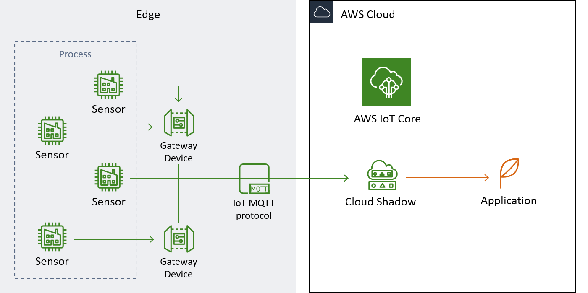

# Contents
* [Introduction](https://github.com/AnHosu/iot_poc#introduction)
* [Hardware Setup](https://github.com/AnHosu/iot_poc#the-hardware-setup)
* [Cases](https://github.com/AnHosu/iot_poc#case-setups)
    * [Simple publishing](https://github.com/AnHosu/iot_poc#1-connecting-a-thing-to-aws-iot)
    * [Using thing shadows](https://github.com/AnHosu/iot_poc#2-using-thing-shadows)
    * [Publish and subscribe](https://github.com/AnHosu/iot_poc#3-publish-and-subscribe)
    * [Using Greengrass](https://github.com/AnHosu/iot_poc#4-connecting-things-through-aws-greengrass)
    * [Shadows, Greengrass, and ML models](https://github.com/AnHosu/iot_poc#5-connecting-things-through-aws-greengrass)
* [Introduction to AWS IoT](https://github.com/AnHosu/iot_poc#aws-iot)

# Introduction
This repo is structured as an introduction to Industrial Internet of Things. On one hand it will be a simple introduction to how you might go about getting your sensor data from your sensor to the cloud. On the other hand, we will dive into advanced IoT concepts, so if you are looking for demonstrations of concepts like edge inference, fleet management, MQTT, and digital twins you have come to the right place.<br>
There are many ways to do IoT and there is an ocean of offerings out there. This introduction focuses on AWS IoT and uses the AWS IoT SDK for Python. The concepts are transferrable to other services, but we will write code specifically for AWS IoT and we will do so mostly in Python.<br>
AWS offers multiple ways to ingest and store data, but for industrial scale sensor data it especially makes sense to look at the AWS IoT and streaming offerings. However, even here there are different ways to go about doing the same thing and the nuances can get confusing. I did not find a great tutorial comparing different functionality side by side, so I decided to make it. The tutorial consists a general introduction below and five seperate demonstrations designed to exemplify increasingly complex functionality. In each case, We will work from scratch to the full setup, making it a full proof of concept for an AWS IoT setup. I recommend starting at case 1 and working your way through each case before proceeding to the next. A full disclaimer before you get started though; the tutorial does reflect some subjective opinions and I am by no means an expert on the subject, but the tutorial arises from my work with IoT in a manufacturing setting.<br>
**What if I just want the code to publish sensor data to IoT?** Well, then you should head straight for case 1: simple publishing.
**AWS IoT for web applications?** Not in this tutorial, unfortunately.
# The Hardware Setup
It would not be IoT without at least one IoT device. The demonstrations focus on the software layer but use actual hardware to prove the concepts. I have been using a Raspberry Pi 3 Model B+ along with a Bosch BME680 sensor on a [breakout](https://shop.pimoroni.com/products/bme680-breakout "Pimoroni BME680 breakout"). Any sensor would do, but I like this one and this particular breakout beacause it has a nice [library](https://github.com/pimoroni/bme680-python "Pimoroni BME680 library") which allows us to reduce the amount of code we need to query our sensor to a minimum. Furthermore, this particular sensor has four different components, allowing us to measure temperature, pressure, humidity, and, with a bit of additional work, air quality. I will not elaborate too much on this particular sensor equipment for this demonstration and I will try to be clear about when you can replace my code with that querying your particular sensor.<br>
In IoT terms the sensor is the 'thing' or 'device', and our Rasoberry Pi is the 'edge' or 'gateway device'. Names are not too important and, in real life, you would use different hardware for different situations.
<div align="center">
	
	<br>
    Raspberry Pi 3 Model B+ with the BME680 sensor. The sensor is intentionally placed quite close to the CPU, which will interfere with the temperature readings. In case 4, we will deploy calculations from AWS onto the Pi to correct for this, as an example of edge calculations.
</div>

We are going to do four different cases in total. Hardware-wise everything will be the same throughout; BME680 connected to the Pi which in turn is connected to the internet. If you are using the same breakout, take a look at [this tutorial](https://learn.pimoroni.com/tutorial/sandyj/getting-started-with-bme680-breakout "BME680 tutorial") to set it up.
# Demonstrations
The five demonstrations are the main attraction of this tutorial, and if you are looking for examples and code snippets, then go ahead and dive right in. If you prefer a bit of theoretical background before you get started, then jump to the next section before starting the cases.
## 1) Connecting a Thing to AWS IoT
The simplest way to do IoT with AWS. We will register our sensor as a thing in AWS IoT Core and will be using the AWS IoT Python SDK to publish sensor readings to a topic. We go through concepts such as things, topics, MQTT, and more.<br>
In this case the Raspberry is simply simulating a microcontroller that will query the sensor and publish the result.<br><br>
[Get started here](https://github.com/AnHosu/iot_poc/blob/master/publishing.md "simple publishing case").
Here is the full [example script](https://github.com/AnHosu/iot_poc/blob/master/simple_publishing.py "simple publishing example").
## 2) Publish and Subscribe
In this case, we build upon the previous case and are constructing a setup where our device will not just send data but also respond to messages sent to it.<br>
The Raspberry Pi is still just simulating a microcontroller, but we start to see how compute at the edge is usefull and can be managed with AWS IoT.<br><br>
[Get started here](https://github.com/AnHosu/iot_poc/blob/master/pubsub.md "simple publishing case"). Here is the full [example script](https://github.com/AnHosu/iot_poc/blob/master/simple_pubsub.py "simple pubsub example").
## 3) Using Thing Shadows
Using the Thing Shadow feature of AWS IoT, we will create a twin/shadow of our device in the cloud and update it whenever a new reading is available. You can use this cool feature to build a digital twin of your process.<br>
The Raspberry is still simulating a microcontroller that will query the sensor, but instead of just publishing the result, it will update the Shadow document of the Thing.<br><br>
[Get started here](https://github.com/AnHosu/iot_poc/blob/master/shadow.md "simple publishing case"). Here is the full [example script](https://github.com/AnHosu/iot_poc/blob/master/shadow.py "shadow example").
## 4) Connecting Things through AWS Greengrass
Now our Pi will act the part of gateway device. The gateway device is where edge calculations will happen. This could be signal processing, edge analytics, or even machine learning models. Greengrass is the AWS offering for gateway devices. In this demonstration we will set up Greengrass on the Pi, deploy a calculation from the cloud to the edge, and  <br><br>
This case is still under construction, but here is the [example script](https://github.com/AnHosu/iot_poc/blob/master/greengrass_thing.py "simple greengrass example") so far.
## 5) Shadows, Greengrass, and ML Models
We will combine everything and finally deploy a machine learning model to the edge.<br><br>
This case is still under construction.
# IoT with AWS IoT
This section has a bit of theoretical context for the demonstrations. I am going to do my best to explain core concepts of internet of things in the context of an industrial setting and AWS IoT. 
### Things
Let us start with the so called Things. In an industrial setting, a thing is often anything that has a measurable state, is being actively measured, and is connected to the internet. A simple example might be temperature at the factory floor. This is obviously a critical variable in many manufacturing processes and you will find old school thermometers installed here and there. These are not things, however, until they are connected to the internet either directly or indirectly through a gateway device. Other examples could be the airflow through a specific nozzle driving components forward in an assembly process or the injection pressure for the plastic in an injection moulding process. The airflow could be measured using a flowmeter and the injection pressure with a pressure sensor. These could then be connected to a small computer that in turn connects to the internet.<br>
Given this vague definition of things, an obvious question arises for those who have been in the manufacturing game for a while. Manufacturing processes are usually associated with process control loops. These include connecting key process parameters to a process logic controller (PLC) that in turn controls actuators to regulate the process. An example would be the flow of water through a pipe, measured by a flow sensor and regulated by the opening or closing of a valve. The question is: are these control loops also IoT? The answer is that they could be. The process parameters and the state of the valve are all potential things that when connected to the internet become things in the internet of things. The key difference between IoT and a control loop would be the internet connection. The PLC is there to do process control, not neccessarily to send or store data, and connecting it to the internet could be a major risk for the manufacturing process. In IoT we use dedicated devices to buffer and send data to storage in the cloud or somewhere else.<br>
AWS is our cloud of choice for this tutorial. In AWS IoT Core, you can [register](https://docs.aws.amazon.com/iot/latest/developerguide/create-aws-thing.html "how to register a thing in AWS IoT Core") and manage your things. A thing is the highest level of granularity, and it makes sense to register each parameter you measure as a seperate thing. You can then aggregate and manage hierarchies of things using [groups and types](https://docs.aws.amazon.com/iot/latest/developerguide/iot-thing-management.html "about managing hierarchies of things").
<div align="center">
	
	<br>
</div>

### The Edge and Gateway Devices
I have mentioned gateway devices a few times. A gateway device is basically just a computer. It could be as small as a microcontroller and as large as a distributed compute system. In this tutorial we will use a Raspberry Pi to play the part of gateway device. In an industrial setting the gateway devices are there to do the things that a PLC should not do, like connecting to the internet, doing heavy calculations, and buffering data. You might already have guessed it, but the gateway device is essentially what is referred to as 'the edge'. Running machine learning at the edge essentially means having a machine learning algorithm do inference using the compute in our gateway device. A gateway device can be used for a bunch of other things though, such as signal processesing, data aggregation, or data transformation. Imagine for instance that your sensor reports the factory floor temperature in degrees Celcius. Maybe you want to convert that into Kelvins before sending and storing it in the cloud. Of course you could store the measurement in Celcius and then do the transformation later or directly in your application, but that would be more expensive (cloud compute is expensive, cloud storage is cheap) and less elegant. Run your computations at the edge whenever it makes sense and save money.<br>
The edge device is where we will run the client that connects to AWS IoT, sends data, and maybe receives instructions. To do so we will use the AWS IoT Python SDK. AWS also provides software for managing and running your applications on gateway devices. These are called Greengrass and SiteWise (which is just additional software on top of Greengrass). Greengrass allows you to do cool things such as running lambda functions and deploy machine learning models from the cloud to the edge. Greengrass and its functionality is covered in cases 4 and 5.<br> 
### Digital Twins and Shadows
You are doing IoT for a reason. Maybe you are building a dashboard for the operators of your manufacturing line, maybe your are developing a predictive maintenance model that uses measured parameters from the line to predict the remaining lifespan of a critical component. Whatever your application, you will need fresh data from your things. Unless you have gone all in on a massive synchronisation effort, your data points will not arrive at exactly matching timestamps, however. Factory floor humidity might be reported every 5 minutes while frequency and amplitude of a vibrating element might be reported every 15 seconds. Maybe the gateway device handling data from your flow sensors has been updating its software such that no values have been reported for the past 12 minutes. What does your application do when the refresh rate might be every 30 seconds? If all values are stored in a database, the application could just grab the latest values, but that might not be possible or introduce unwanted latency. There is another way, however.<br>
A digital twin is a record of the latest process parameters, such that the currently most reliable view of reality is always available for applications. The notion is similar to a database, the key difference being that this record only ever keeps the latest entry. With such a record you can design your application to do what it needs to do and even dynamically correct for old data without ever worrying about not having available data or waiting for data to appear, thus effectively decoupling the IoT and your application.<br>
AWS IoT offers a functionality called shadows, which allows you to create a digital twin for your process. Each thing registered in AWS IoT automatically has a shadow, which is a json document containing the latest record for that thing, assuming you have set up your IoT to do so. In case 3, we will explore how to interact with shadows in the cloud. Using Greengrass, you can also keep a shadow on the edge and even enable shadow synchronisation between the edge and the cloud. In this way your applications running at the edge can access shadow record with low latency, while cloud based applications have copy available to them as well. We will explore the use of local shadows with Greengrass for a machine learning application in case 5.
<div align="center">
	
	<br>
</div>

### SDK
We will be using the Python SDK to configure the client that communicates with AWS. This means that our gateway device has to be able to run Python. This is no problem on a Raspberry Pi, but would not work for a microcontroller and probably would not be ideal for a web application. AWS IoT offers SDKs for a bunch of [other languages](https://docs.aws.amazon.com/iot/latest/developerguide/iot-sdks.html "AWS IoT SDKs), however.<br>
This tutorial uses the [first version](https://github.com/aws/aws-iot-device-sdk-python "AWS IoT Python SDK V1") of the Python SDK. A [version two](https://github.com/aws/aws-iot-device-sdk-python-v2 "AWS IoT Python SDK V2") that uses a very different syntax was released, but will not be covered here.<br>
### The MQTT Protocol
Communication with AWS is facilitated by the MQTT protocol. This is a protocol commonly used in manufacturing systems, and is documented [online](http://mqtt.org/documentation "MQTT documentation"). You can also read about the [AWS flavour](https://docs.aws.amazon.com/iot/latest/developerguide/mqtt.html "AWS MQTT Documentation") of MQTT. Communicating using HTTPS is also possible but is not covered in this tutorial.<br>
To get started using the MQTT protocol with AWS IoT, you only need to know a few concepts: message, topic, quality of service (QoS), publishing, and subsribing. I have summarised them here so you don't have to read the entire documentation.
#### Messages
The message contains the actual data along with any metadata. It is structured as a json and you can put whatever you want in there, but you will want the reading from your thing, a timestamp for the time of sampling, and maybe an idication whether the reading was succesful or not. 
#### Topics
Messages in AWS are distributed and filtered using topics. Topics are a kind of tag that you can use to identify the source of the message and distribute it accordingly. It is just a single string, generally in the format
```
main_tag/secondary_tag/tertiary_tag/etc
```
For instance, if you had several factories each with several manufacturing lines with several stations each eqipped with sensors, you might do something like
```
factoryA/line22/drying/temperature
```
and then have another sensor on the same line publish to
```
factoryA/line22/milling/torque
```
That way you can direct these messages to the store or dashboard for the same line but seperate lambda functions, if that is needed for your application.<br>
The topic system is quite flexible and you will have to rely on your own rigid naming conventions if you want to effectivly utilise topics in an application with many things. Some specific topics are reserved for specific purposes such as interacting with shadows. We will dive deeper into the use of topics and reserved topics in the cases.
#### Publishing and Subscribing
Messages are transmitted using the publish subscribe model. A message always has a single publisher. The publisher client is the origin of the message and will publish that message to a given topic. Now a topic can have several publishes, meaning that several clients can publish messages to the same topic. Messages reach their destination through subscribers. Subscribers are clients that listen to a topic to get whatever messages are published there. A topic can also have multiple subscribers.
#### Quality of Service
Quality of Service, abbreviated QoS, is a flag specifying what happens when messages get lost in the network. The AWS flavour of MQTT accepts two QoS flags, 0 means that the message is delivered to subsrcibers 'at most once'. 1 means that the message is delivered to subsribers 'at least once'. So for QoS=0 the publisher will send the message once and then forget about it. If it does not get delivered, it is lost. For QoS=1, however, the message is sent, and the publisher then waits for a reply from the subscriber before forgetting the message, and resends if neccessary. This ensures that the subscriber gets the message at least once.
