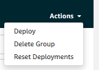

# Build an Edge with Greengrass
It is time to create an edge, to take advantage of the compute that is available right where the data is gathered. Even if you use the AWS IoT services, there are several ways and plenty of 3<sup>rd</sup> party software you could apply for device management and creating an edge. The AWS offering is Greengrass, a piece of software running on your device and an accompanying cloud service. In this demonstration, we introduce key concepts in the context of an IoT edge using Greengrass.<br>
In this demonstration we will
- Install AWS Greengrass Core on our Raspberry Pi
- Register the Pi as a Core Device in the AWS Greengrass console
- Connect a our sensor as a Thing through Greengrass, sending data to AWS IoT
- Define a calculation in the cloud and deploy it onto the edge
# Motivation
When you walk through the demonstration it might seem like a lot of hassle and extra steps to go through before data is flowing and we reach what is essentially the same state as in previous demonstrations, where we just [published](publishing.md) readings and [subscribed](pubsub.md) directly in the script that also queried our sensor. Indeed, Greengrass is not intended for use with a single sensor. Imagine, however, that you are managing hundreds of sensors on a factory floor. The factory might be far away, or the gowning procedure might prohibit frequent visits, but even if your desk is right next to the manufacturing line, you still do not want to physically go there each time you deploy changes to sensor data streams, restart devices, define new signal processing, or update software. Greengrass allows you to define functionality in the cloud and deploy it to your device with a click.<br>
Another important aspect of your IoT application to consider is cost. It is tempting to just send all raw data to storage in the cloud. Cloud storage is indeed inexpensive, but it is not free. What is worse, however, is the cost of compute. Cloud compute offers unprecedented flexibility, but it is expensive, so we generally want to use it to handle loads with varying intensity or low predictability, e.g. for hosting the application that uses data from the IoT setup. As an example of a case where you might quickly incur a large and unnecessary bill, imagine a set of vibration sensors. Vibration sensors are useful for predictive maintenance applications, since the patterns in vibrations from components like bearings and motors might be good predictors for the health of the component. An industrial grade vibration sensor might be able to sample acceleration thousands of times per second. If we were to store the data from just a few vibration sensors, we would quickly fill up enough storage to accomodate years worth of data from other sources like factory floor temperature and humidity. Furthermore, since it is not the accelleration itself but characteristics of the vibrations we are interested in, each time we use the data we would have to do signal processing and recalculate features. If we do that using cloud compute, we will work up quite a bill. The financially and environmentally responsible way to implement vibration sensors is to do the signal processing as close to the sampling point as possible and then only store the calculated features. We still want the flexibility of developing in the cloud and deploying to a remote device, however. While we will not work with signal processing in this demonstration, we will create an example of data transformation and deploy it from the cloud to the Raspberry Pi using Greengrass.<br>
Conceptually, the setup for this demonstration is a bit different from that of the three previous demonstrations. The hardware is exactly the same but, in previous demonstrations, our Raspberry Pi acted the part of a microcontroller and essentially did not do a lot of work. In this demonstration, we will make use of the compute available on the Raspberry Pi, install Greengrass, and use it to manage the sensor. To demonstrate the concept of edge calculations, we will create a transformation that corrects for the fact that the temperature sensor is right next the CPU of our PI.
<div align="center">
	
	<br>
</div>

Notice that the BME680 air quality sensor is right next to the CPU of the Pi. The edge calculation we make will attempt to correct the temperature reading from the BME680 by substracting an amount based on the current CPU temperature.
# Install and Configure Greengrass
The AWS Greengrass service consists of two main elements. Greengrass Core is a piece of software that is installed on your gateway device, in our case, the Raspberry Pi. We loosely refer to the gateway device and Greengrass Core as an 'Edge'. The software is configured to communicate with Greengrass in AWS IoT, which constitutes the other element. We loosely refer to AWS IoT as the 'Cloud' part.<br>
The process of installing Greengrass depends a lot on your device and its operating system, but the docs contain a [general guide](https://docs.aws.amazon.com/greengrass/latest/developerguide/module2.html "install Greengrass"). I used apt to install Greengrass on the Pi. When following this guide, you will
- [Register the Greengrass Core](https://docs.aws.amazon.com/greengrass/latest/developerguide/gg-config.html) in AWS IoT. Remember to download the package with certificates onto your device
- [Download](https://docs.aws.amazon.com/greengrass/latest/developerguide/what-is-gg.html#gg-core-download-tab "ggc software") the packaged software for your specific device and operating system
- Set up the user group (ggc_group) and user (ggc_user) that Greengrass Core will assume on your device
- [Unpack software](https://docs.aws.amazon.com/greengrass/latest/developerguide/gg-device-start.html) and install certificates
- Download and install the root CA certificate

If it is not already available on the device, we might want to install the Java 8 runtime
```bash
sudo apt install openjdk-8-jdk
```
For this demonstration we will use Python 3.7 for the functions we deploy into Greengrass Core. Therefore we also need to make sure that Python 3.7 is available to Greengrass core on the device.<br><br>
In order for Greengrass to use these runtimes, the names of the binaries must be very specific. Python must be named `Python3.7` and the Java runtime must be named `Java8`. If the versions installed are correct, but the binaries are not named the way Greengrass expects, e.g. Java 8 is just called `Java`, we can either rename them or create symlinks:
```bash
# These are examples. Modify to your particular setup
sudo ln -s /usr/bin/python3 /usr/bin/python3.7
sudo ln -s /usr/bin/java /usr/bin/java8
```
Once you have done all these steps, you might want to check that you have all the dependencies you need by running the Greengrass dependency checker:
```bash
mkdir greengrass-dependency-checker-GGCv1.10.x
cd greengrass-dependency-checker-GGCv1.10.x
wget https://github.com/aws-samples/aws-greengrass-samples/raw/master/greengrass-dependency-checker-GGCv1.10.x.zip
unzip greengrass-dependency-checker-GGCv1.10.x.zip
cd greengrass-dependency-checker-GGCv1.10.x
sudo ./check_ggc_dependencies | more
```
The dependency checker will also provide hints if it cannot locate Python or Java. Make sure these are available, but we do not need the other optional dependencies.<br>
When all is set up and configured, you can start Greengrass by running
```bash
cd /greengrass/ggc/core/
sudo ./greengrassd start
```
Greengrass Core will need to be running on your device in order to establish a connection between Core and the cloud. You can walk through the [AWS hello world cases](https://docs.aws.amazon.com/greengrass/latest/developerguide/module3-I.html) to familiarise yourself with Greengrass. We are going to do many of the same things in this demonstration but in a slightly different order and using our hardware setup instead of simulated devices.
# Build a Greengrass Group
During the setup, we created a Greengrass Group. The Group will eventually consist of one core device (in our case the Pi) and a variety of entities associated with the core. Our eventual goal is to have data sent from a thing that is associated with the core to the cloud. To reach that ambition we need to configure the thing, i.e. our sensor, a Lambda function that will move the data to the cloud, and subscriptions. We will go through each of these components in turn, starting with the thing.<br>
<div align="center">
	
    <br>
    This is the architecture we are building, albeit with just one sensor.
	<br>
</div>

## Associate a Thing with a Greengrass Group
To associate our thing, the sensor, with the core, we follow the [guidelines](https://docs.aws.amazon.com/greengrass/latest/developerguide/device-group.html "register a thing in Greengrass"), and go to AWS IoT > Greengrass > Groups, choose the group we just created, go to Devices, and click "Add Device". The creation procedure is similar to the procedure for any other Thing registered in AWS IoT. Indeed, after registering the device, you will be able to find it under the AWS IoT > Manage tab and you are even able to associate existing devices with a core. I actually reused the device from the [publishing](publishing.md#registering-the-sensor-in-iot-core) demonstration for this demo.<br>
Note that before the device is fully associated with the core, the change needs to be deployed. Later we will go through how to do this, but feel free to go ahead and do it right away, if you know how.
## Connect a Device to Greengrass Core
In this section, we will setup up a script that connects to the core with the eventual goal of publishing readings from the sensor to a topic. The messages will never reach the cloud, however. Instead, the messages are published into the core device on a topic that only lives within the the Greengrass group. The logic is something along the lines of
```
setup sensor
connect to Greengrass core
while true
	get sensor values
	publish to local topic
```
You might notice that this logic is very similar to what we did in the case of simple [publishing](publishing.md), and indeed the two cases are very similar. The main difference is that we will set up and configure a client that connects to Greengrass Core rather than IoT Core. <br>
To connect a device/thing to Greengrass core, we use the same MQTT client as always and, as usual, we will need a variety of resources to establish the right connection.
```python
from AWSIoTPythonSDK.MQTTLib import AWSIoTMQTTClient

myAWSIoTMQTTClient = AWSIoTMQTTClient(clientId)
myAWSIoTMQTTClient.configureCredentials(groupCA, privateKeyPath, certificatePath)
myAWSIoTMQTTClient.configureEndpoint(coreHost, corePort)
```
Let us discuss each of these resources in turn.
- ClientId could be anything allowed by the policy you created for your thing in the previous step. To keep down complexity, using the device ID is a prudent idea.
- privateKeyPath is the complete path to the key associated with the certificate created earlier for your thing.
- certificatePath is the complete path to the certificate for your thing that you created earlier.
- groupCA is the certificate authority for your Greengrass group and is used to authenticate that your thing is indeed connected to the intended Greengrass core when sending and receiving messages. In a moment we will walk through how to obtain this certificate. Note that this is *not* the root certificate authority used when communicating with AWS IoT Core.
- coreHost is the server running the Greengrass Core, i.e. your core device
- corePort is the port on which your thing will communicate with the core using the MQTT protocol. The default setting for when generating a new Greengrass Core is 8883, but you can [configure](https://docs.aws.amazon.com/greengrass/latest/developerguide/gg-core.html) this

The three first elements are realtively straight forward; you know these from when you created the thing and its certificate in the first place. The three remaining resources, however, require a bit of additional work. The group certificate is managed by AWS and by default it is rotated every 7 days. This requires a little bit of effort on our part when connecting things to the core, but is worth it for the free added security. Since the the Greengrass Core is connected to AWS, AWS also knows the host and port, and so while we are querying AWS for the group certificate, we can also retrieve these two pieces of information. This process of retrieving connection information is called core discovery and is the only time our thing will connect to AWS. Once connected to the core, all communication will be with it.<br>
### Core Discovery
To set up the discovery process, we need a special dicovery client that is also included in the AWS IoT SDK
```python
from AWSIoTPythonSDK.core.greengrass.discovery.providers import DiscoveryInfoProvider

discoveryInfoProvider = DiscoveryInfoProvider()
discoveryInfoProvider.configureEndpoint(host)
discoveryInfoProvider.configureCredentials(rootCAPath, certificatePath, privateKeyPath)
discoveryInfoProvider.configureTimeout(10)
```
The discovery client is set up using the usual materials; the AWS IoT custom endpoint for your account, the AWS root certificate authority, the private key, and certificate for your thing. We also tell the client to wait a maximum of 10 seconds before timing out a connection attempt.<br>
The client can be used to send a discovery request to AWS and fetch connection information for the core. It works like this:
```python
# Returns list of AWSIoTPythonSDK.core.greengrass.discovery.models.DiscoveryInfo objects
discoveryInfo = discoveryInfoProvider.discover(thingName)
```
We provide the thing name of the thing for which we are looking up connection information. In most of your applications this is probably the same as your client name, but in this case it *has* to be the name of your thing as registered in AWS.<br>
If the request is successful, `discoveryInfo` will hold information about Greengrass groups that the device belongs to (a device can belong to several groups, but each group has exactly one core). Of interest to us are the certification authorities and the connection information, the lists of which can be accessed as such:
```python
# Returns list of AWSIoTPythonSDK.core.greengrass.discovery.models.CoreConnectivtyInfo objects
caList = discoveryInfo.getAllCas()
# Returns list of tuples (CA content, group ID)
coreList = discoveryInfo.getAllCores()
```
These are lists with each entry representing a core. If your device only belongs to a single Greengrass core, this list will only have one entry. We can get the certificate authority for the first available core like this
```python
groupId, ca = caList[0]
```
Each core might have several connection options so we might like to keep them in a list to loop over later
```python
coreInfo = coreList[0]
# Get a list of tuples (host, port)
coreConnectivityInfoList = coreInfo.connectivityInfoList
```
Now we have everything we need to have out thing automatically discover and connect to the Greengrass core:
```python
from AWSIoTPythonSDK.core.greengrass.discovery.providers import DiscoveryInfoProvider
from AWSIoTPythonSDK.core.protocol.connection.cores import ProgressiveBackOffCore
from AWSIoTPythonSDK.MQTTLib import AWSIoTMQTTClient
# Configure client for gg core discovery
discoveryInfoProvider = DiscoveryInfoProvider()
discoveryInfoProvider.configureEndpoint(host)
discoveryInfoProvider.configureCredentials(rootCAPath, certificatePath, privateKeyPath)
discoveryInfoProvider.configureTimeout(10)
# Discover gg cores for the thing
discoveryInfo = discoveryInfoProvider.discover(thingName)
# Get connection info
caList = discoveryInfo.getAllCas()
coreList = discoveryInfo.getAllCores()
# Get info for the first core
groupId, ca = caList[0]
coreInfo = coreList[0]
coreConnectivityInfoList = coreInfo.connectivityInfoList

# Since the MQTT client expects a certificate file we have to
#  put the group certificate authority into a file and save
#  the path
groupCA = GROUP_CA_PATH + groupId + "_CA_" + str(uuid.uuid4()) + ".crt"
if not os.path.exists(GROUP_CA_PATH):
    os.makedirs(GROUP_CA_PATH)
groupCAFile = open(groupCA, "w")
groupCAFile.write(ca)
groupCAFile.close()
    
# Initialise the MQTT client
myAWSIoTMQTTClient = AWSIoTMQTTClient(clientId)
myAWSIoTMQTTClient.configureCredentials(groupCA, privateKeyPath, certificatePath)

# Loop over and try connection with each set of host name and port
connected = False
for connectionInfo in coreConnectivityInfoList:
    coreHost = connectionInfo.host
    corePort = connectionInfo.port
    myAWSIoTMQTTClient.configureEndpoint(coreHost, corePort)
    try:
        myAWSIoTMQTTClient.connect()
        connected = True
        break
    except BaseException as e:
        pass
```
This is the most condensed code needed to implement discovery, but in production you will want to add much more logging, error handling, retries for discoveries, and other frills. See the section below on Greengrass in production for a further discussion on how to improve the thing script for a real world scenario.
### Publish inside the Greengrass Group
Now that our thing is connected to the core in its Greengrass group we can start publishing data to a local topic. From the point of view of our thing, this works just like publishing to a topic on AWS IoT. Using the client we configured:
```python
myAWSIoTMQTTClient.publish(topic, messageJson, 1)
```
With this, we have everything needed to run our thing running. The [example script](greengrass_thing.py "example script") for this section summarises everything we have done so far but contains a bit more detail. It is based off of the [example](https://github.com/aws/aws-iot-device-sdk-python/blob/master/samples/greengrass/basicDiscovery.py "AWS IoT SDK basic discovery example") included with the AWS IoT SDK and was adapted to be used with our hardware setup. Note that the functionality in this script is running on the same Pi as the Greengrass software. In a real production setting, however, the two are likely to be seperate physical devices.<br>

Once again, it is worth noting that if you have not deployed after associating the thing with the core, then your core device does not yet know that it is allowed to associate with the thing and the discovery process will fail. Specifically, you will get a `DiscoveryDataNotFoundException`. It happens to me all the time, but all we need to do is deploy the change. I will show you how in a moment.<br>
Even assuming that the Greengrass core is running and the thing script is publishing values, not much is happening yet. If you go to the AWS IoT test test client in the console and subscribe to the topic that the thing is publishing to, there should be no values flowing in, as nothing is being sent there. In order for us to see data flowing into the cloud, we have to grab the data in Greengrass Core and pass it on to a new topic that is published to the cloud.<br>
The way this is done with Greengrass is by defining a Lambda function in AWS and deploying onto the core.
## Write Lambda Functions for Greengrass
Lambda functions are a huge subject on its own and, for the purposes of this demonstration, we will assume at least some fammiliarity with the concept. We will still walk through each step needed to writing a Lambda for the edge, but if you are new to AWS Lambda, you might want to read the [getting started guide](https://docs.aws.amazon.com/lambda/latest/dg/getting-started.html "AWS Lambda getting started") to get a feel for the terminology. Lambda is a pretty cool service, and chances are that you will find it useful for plenty of other applications.<br>
### Lambda Code
The first Lambda we will write is very simple. It should take an incoming MQTT message, parse the message, and republish it to a new topic to AWS IoT. So something along the lines of
```
get incoming message
extract body of message
republish body to new topic
```
Very linear, if we assume that the code is only run when there is an incoming message. This is exactly the power of Lambda. We can make a MQTT message, such as the ones we publish from the sensor, trigger a Lambda function. In the next section, we will go through how to set up the trigger. For now, just assume that the code we write is triggered each time there is a message.<br>
A Lambda always has a function handler that contains the details of whatever triggered the function:
```python
def function_handler(event, context):
    # event holds the message body
    # context holds the incoming topic etc.
```
You can name the function whatever you want, just as long as you remember that name and give it the input objects event and context.<br>
The event object holds the body of the MQTT message that triggered the Lambda. This is essentially the json we want to pass on to a new topic.<br>
The context object holds all sorts of information on what triggered the Lambda, including the topic of the message. We do not really need any of this information now, so we can just ignore it.<br>
In order to republish to AWS IoT, we are, as usual, going to need an MQTT client. Remember though that we went through all sorts of trouble to connect the core to AWS IoT and that the core is running all the time, so there is no need to set up a new client and connection. Instead, we use one of the clients included in the [Greengrass SDK](https://github.com/aws/aws-greengrass-core-sdk-python "Greengrass Python SDK"):
```python
import greengrasssdk

client = greengrasssdk.client('iot-data')
```
You do not have to install the SDK on your computer, but we will need to include it in our Lambda. There are multiple client types included in the SDK, and since we are doing IoT stuff, we need the `iot-data` client.<br>
Now we just need to decide on the topic to publish to. This needs to be a topic allowed in the policy for the thing. With that, we have everything needed for the Lambda function:
```python
import greengrasssdk

REPUB_TOPIC = 'republish/reading'

client = greengrasssdk.client('iot-data')

def function_handler(event, context):
    client.publish(topic=REPUB_TOPIC, payload=event)
    return
```
This is all we need to republish. The full example with a few extra frills, such as adding the incoming topic to the output body, is [here](greengrass_simple_lambda.py "Simple Lambda example for Greengrass"). Let us now look at creating the actual Lambda.
### Create a Lambda Function
To create a Lambda function, we navigate to the AWS Lambda console. Under 'Functions' we click 'Create Function'.<br>
In the wizard, choose 'Author from scratch', give your function a name, and choose your Python runtime. I named mine 'repub_temp' and have been using Python 3.7 for the example. Then we click 'Create Function'. This might take a moment.<br>
<div align="center">
	
	<br>
</div>

The next thing we need to do is to prepare our code for the Lambda function. So leave the console for a little while and locate the Python script we just created. Now download the [Greengrass SDK](https://github.com/aws/aws-greengrass-core-sdk-python/tree/master/greengrasssdk) folder. You only need the 'greengrasssdk' folder, not the examples, docs, etc. Now package the Greengrass SDK and the Python script into a .zip.<br>
<div align="center">
	
	<br>
</div>

Now jump back to the console and scroll down to the 'Function Code' window. In the 'Code entry type' dropdown, select the 'Upload a .zip file' option and upload the -zip file we just created. Also make sure to change the Handler to `<function file>.<your handler function>`, in the case of this example, it is `greengrass_simple_lambda.function_handler`. Click 'Save' to save the changes.
<div align="center">
	
	<br>
</div>

Now scroll up and, under the 'Actions' dropdown, select 'Publish new version'. You can optionally provide a version description.<br>
<div align="center">
	
	<br>
</div>

Now go to 'Actions' again and select 'Create alias'. Give the alias a name and point it to the version you just created. Greengrass does not support pointers to the `$latest` version, so make sure to select a specific version.<br>
<div align="center">
	
	<br>
</div>

Now that our Lambda has been fully defined, we need to associate it with the Greengrass core.
### Attach a Lambda to Greengrass
Navigate to the Greengrass console. Go to 'Groups' and select your Greengrass group. Then go to the 'Lambdas' menu and click 'Add Lambda'.<br>
<div align="center">
	
	<br>
</div>

Choose 'Use an existing Lambda function'. Select the Lambda function we just created and click 'Next'. Select the alias we just created and click 'Finish'.<br>
That is it for the Lambda. Now the final piece of the puzzle is ensuring that data flows from the sensor to the Lambda function and then from the Lambda function to the cloud. This is done with subscriptions.
## Configure Subscriptions in Greengrass
Subscriptions is the way to configure where what data goes inside the Greengrass group. They specify the pubsub verticies between the things and Lambdas of the group and offer filtering capabilities.<br>
To set up a subscription, go to the Greengrass console. Go to 'Groups' and select your Greengrass group. Then go to the 'Subscriptions' menu and click 'Add Subscription'.
<div align="center">
	
	<br>
</div>

When setting up at subscription we are asked to specify the source and the target. The source and target could be many things, including a specific device/thing, a Lambda function, the cloud, or a Shadow. Subscriptions are one-way, so a two-way communication between two entities within the group would require two subscriptions.<br>
For this demonstration specifically, we want to set up a subscription from our thing which generates and publishes data locally to the Lambda function we created. The thing can be found under the 'Devices' tab and the function under the 'Lambdas' tab.<br>
Clicking 'Next' the first time will spawn a topic filter box. This is an optional filter you can specify to make data flows even more dynamic. I have given an example here, but it is not neccessary for the purposes of this demonstration. Click 'Next' again and 'Finish' to create the subscription.
<div align="center">
	
	<br>
</div>

We need one more subscription, namely the one telling Greengrass that we are publishing data from the Lambda function to the Cloud. We set up another subscription; this time setting the Lambda function as the source and 'IoT Cloud' as the target. Again we can specify an optional filter.
<div align="center">
	
	<br>
</div>

Now all the pieces are in place. We are ready to deploy.
## Deploy a Greengrass Group
Right now, nothing is running on our gateway device except for the Greengrass daemon. Unless you have deployed along the way, none of the device configurations, Lambda function, or subscriptions have made their way onto the core.<br>
Before deploying, we should make sure that the Greengrass Daemon is actually running on our gateway device. From a shell on our device
```bash
ps aux | grep -E 'greengrass.*daemon'
```
If the output from this command includes a root entry for `/greengrass/ggc/packages/1.10.1/bin/daemon`, then the daemon is running. If the daemon is not running, recall that we can start it using:
```bash
cd /greengrass/ggc/core/
sudo ./greengrassd start
```

Now we are ready to deploy. Fortunately it is very simple to deploy everything we have specified. From our group in the Greengrass console, we are always within sight of the 'Action' dropdown menu which has a 'Deploy' option that we will now click on and utilise. If all goes well the status of our device will go from 'Is pending' to 'In progress' to 'Successfully completed'.
<div align="center">
	
	<br>
</div>

## Put Everything Together
To get the example for this section to work, we need to do a few things in the correct order.
1. Ensure that the device representing our sensor is associated with the core
2. Ensure that the [Lambda function](greengrass_simple_lambda.py) is defined and associated with the core
3. Ensure that there is a subscription from the device to the Lambda function and another subscription from the Lambda function to the cloud
4. Ensure that the Greengrass daemon is running
5. Deploy everything
6. Run the discovery and publishing [script](greengrass_thing.py) for the sensor device

We can run the script like this:
```bash
python3.7 greengrass_thing.py -e <AWS IoT custom endpoint> -r <root CA> -c <thing certificate> -k <private key> -id <client ID> -t <local topic>
```
And let us quickly look at whether it is working by going to the IoT test client. If we have done everythin correctly, we should not see any data published on the local topic from the sensor device. Rather, we should see data from the topic `republish/reading` topic that we defined in the Lambda script. Let us see.
<div align="center">
	
	<br>
</div>

It is indeed working!<br><br>
Congratulations! You now know how to work with Greengrass and you have all the neccessary components to create your own Greengrass groups and create powerful IoTs with edges. However, if you are interested and want to know why we went through so much trouble to connect our device through Greengrass, I have another small example demonstrating the concept and power of 'calculations on the edge'.
# Do Calculations on the Edge
Compared to [simple publishing](publishing.md), having a device publish its data through Greengrass might seem like a large unnecessary hassle. Indeed, sometimes it is, but as soon as your IoT starts to grow beyond a few devices, there will be headaches that are much more simple to solve when Greengrass and, in particular, Lambda is there.<br>
In this example, we will demonstrate the utility of the setup through a simple example. I placed the BME680 air quality sensor quite close to the CPU, meaning that the temperature of the CPU will interfere with what I really want to measure; the temperature of the air. If we were to obtain the temperature of the CPU, we might be able to calcualte a compensated temperature that is more representative of the air temperature. A quick disclaimer before we begin: there are a plethora of ways to avoid or compensate for this particular problem, including extending the sensor away from the Pi or including the compensation logic in the feeder script, but for the sake of this example assume that we have no flexibility in terms of the hardware and are aiming for a high degree of flexibility and maintainability in the software we create.<br><br>
Specifically, we will create a Lambda function that performs the compensation for us. We will go for something simple like
```
compensated_temperature = 2 * temperature_reading - average_cpu_temperature
```
This is a very rough estimate, but it will get us going with a minimum viable solution.<br>
Since we are working with a Raspberry Pi, we can easily get the CPU temperature by reading the file `/sys/class/thermal/thermal_zone0/temp` like this:
```python
def get_cpu_temperature():
    f = open("/sys/class/thermal/thermal_zone0/temp")
    raw_temp = f.read()
    f.close()
    return float(raw_temp)/1000.0
```
CPU temperatures can be somewhat jittery, so let us read the temperature in an interval an get the average before we calculate the compensated temperature
```python
for n in range(8):
    cpu_temps.append(get_cpu_temperature())
    time.sleep(1)
avg_cpu_temp = sum(cpu_temps)/float(len(cpu_temps))
# Compensated temperature
comp_temp = 2*input_temperature - avg_cpu_temp
```
That is really all there is to it, and this is all we need to add to the previous example. The [full Lambda function example](greengrass_sys_lambda.py) has a few extra frills such as error handing and logging. The next step is to define this Lambda function and associate it with the Greengrass group. You could create a new Lambda function, but I opted to update the Lambda function we created in the previous section. To do so, open the function in the Lambda console, insert the [code](greengrass_sys_lambda.py) and publish a new version. Then, from the 'Version' dropdown menu, select the alias we created earlier.
<div align="center">
	
	<br>
</div>

Scroll down a bit, find the 'Alias configuration', and point the alias to the version of the Lambda we just created. Click 'Save' to save changes.<br>
Before we deploy, the Lambda will need some additional configuring. Per default, any Lambda will timeout after 3 seconds, but ours will be running for at least 8 seconds to get an average CPU temperature. Furthermore, Lambda functions running in Greengrass to not have access to local resources under `/sys`. We will need to change these defaults.<br>
Go to the Greengrass console and select the group. Under the Lambda menu, click the three dots in the upper right of the Lambda function, we just modified and select 'Edit configuration'.
<div align="center">
	
	<br>
</div>

Set the timeout to 10 seconds and enable access to `/sys`.
<div align="center">
	
	<br>
</div>

All that is left is to deploy the Greengrass group from the Greengrass console. The resulting output to the cloud should look exactly like before. This time around though, the temperature readings should look a bit more realistic.<br><br>
Congratulations! You are now doing calculations on the edge. It might not feel like much, but consider how we might have gone about solving the problem in other ways.<br>
We could have published CPU temperature readings to the cloud and done the calcualtions using Lambda functions, SQL queries, or EC2 compute in the cloud. The cost of the additional storage and the cloud compute would make such a solution several times more expensive that what we just did.<br>
We could have put the calculations directly in the feeder script. While this would cost slightly less than our solution, it increases the operational burden. Sensors and microcontrollers are generally less accessible, especially in a manufacturing context. With our solution we can manage the calculations in the cloud from the comfort of our chair or even home. If we wanted to start recording the temperature in Kelvins, all we would have to do is add the calculation to our Lambda function and deploy the changes.<br><br>
This was a very simple example of edge calculations managed from the cloud. Greengrass is, however, capable of handling much more complex setups than what we just built. Specifically, it is even possible to deploy machine learning models that are trained in the cloud onto the edge. These advanced features of Greengrass are the subject of the next demonstration.
# In Production
This section is not part of the demonstration as such. It is but a short discussion of some of the considerations we have to take when bringing Greengrass to production in a manufacturing environment and how to improve upon the examples to make them production ready. Considerations from [previous demonstrations](publishing.md#in-production) still apply.
## Default vs Custom Core Config
Note that in the demonstration we just went for the default options when setting up the Greengrass core. This creates a new ploicy for the certificate attached to the core. The policy is extremely permissive and, while it works great for demonstration purposes, it might not be what we want in a production setting.<br>
The great thing about Greengrass is that we can define aggregations and handle the diversity of incoming data at the edge and then only publish to a set of neatly organised topics to the cloud.
## Handle Certificate Authority Rotation
Per default, the CA for the local MQTT server run by Greengrass is rotated every 7 days. We can adjust this to be more or less frequent, but if the Greengrass core remains connected to the cloud it will eventually be rotated. This is a layer of free added security that we do not have to manage, but it requires a bit of extra development considerations for our devices.<br>
In particular, our devices must be able to handle a situation where the CA obtained in the initial discovery process is no longer valid. Depending on our production architecture, we might have to call the discovery process again.<br>
More details are available in the [documentation](https://docs.aws.amazon.com/greengrass/latest/developerguide/device-auth.html) in the section 'Certificate Rotation on the Local MQTT Server'.
## Manage the Greengrass Lifecycle
Chances are that the device running Greengrass core will need to reboot at some point. Rather than starting the Greengrass daemon manually, we want it to start automatically on reboot. The [documentation](https://docs.aws.amazon.com/greengrass/latest/developerguide/install-ggc.html#ggc-package-manager-systemd) has information of how to do so but, for a Raspberry Pi, it is fairly straightforward to do using systemd.<br><br>
Verify that the Greengrass configuration option to use systemd is set to yes. The config file can be found on the Greengrass device at `/greengrass/config/config.json`. Ensure that `"useSystemd" : "yes"`, otherwise change it.<br><br>
Make service a service file at `/etc/systemd/system/greengrass.service`
```
[Unit]
Description=Greengrass Daemon

[Service]
Type=forking
PIDFile=/var/run/greengrassd.pid
Restart=on-failure
ExecStart=/greengrass/ggc/core/greengrassd start
ExecReload=/greengrass/ggc/core/greengrassd restart
ExecStop=/greengrass/ggc/core/greengrassd stop

[Install]
WantedBy=multi-user.target
```
Make the service exeutable 
```bash
sudo chmod u+rwx /etc/systemd/system/greengrass.service
```
Add service to systemd
```bash
systemctl enable greengrass.service
```
Test the service by rebooting the device and confirming that the Greengrass daemon is running. We can check whether the daemon is running with
```bash
ps aux | grep -E 'greengrass.*daemon'
```
## Connection Retries and Progressive Backoff Logic
Imagine the following situation. You have a couple of hundred sensors that connect to one or a few Greengrass core devices, and all run off of the same power supply. At one point, the power supply is switched off, maybe it is maintenance maybe it is an error, but after a while power returns and your sensors and their controllers reboot. You set up the controllers such that they will automatically try to reconnect with the core. This is fine, but suddenly the core is getting hundreds of connection requests within a few seconds, so the controllers are receiving errors. Now, obviously there is nothing wrong with the core devices; they are just getting too many requests, so we will want the controllers to retry the connection before giving up. However, we do not want to have them all retry at the same time lest we repeat the story again.<br>
The idea behind progressive backoff logic is to keep retrying but waiting progressively longer for each retry as well as throwing a bit of randomness into the wait time. One type of backoff logic, exponential backoff, waits exponentially longer before each retry. Here is a bit of Python style pseudocode showing the basics of it
```python
import time

retries = 0
wait_time = 2
while retries < max_retries:
    try:
        connect()
        break
    except connectionFailedException:
        time.sleep(wait_time)
        wait_time += wait_time*1.5
        wait_time += random_number
        retries += 1
```
[Each AWS SDK implements](https://docs.aws.amazon.com/general/latest/gr/api-retries.html "AWS Docs on retries") some sort of backoff logic and so does the AWS IoT SDK, so we do not have to do it ourselves. To increase clarity, I did not include the retry logic in the examples for this demonstration, but it is fairly straightforward to get started
```python
from AWSIoTPythonSDK.core.protocol.connection.cores import ProgressiveBackOffCore

backOffCore = ProgressiveBackOffCore()
retries = 0
while retries < max_retries:
    try:
        connect()
        break
    except connectionFailedException:
        backOffCore.backOff()
        retries += 1
```
The SDK also ships with an [example](https://github.com/aws/aws-iot-device-sdk-python/blob/master/samples/greengrass/basicDiscovery.py) very similiar to what we did in the previous sections and also implements this backoff method.