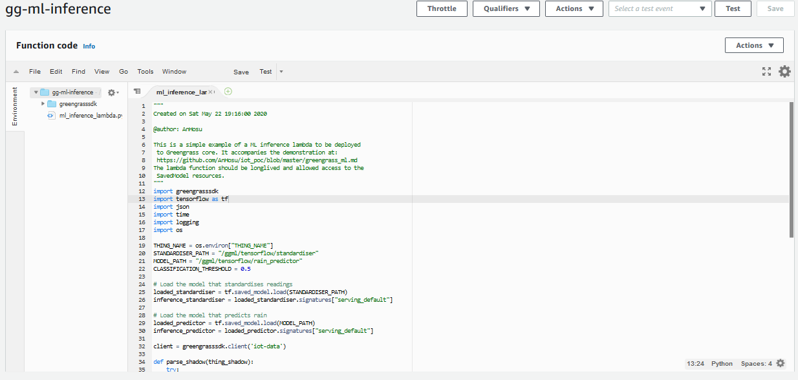

# Advanced Features of Greengrass
We are about to build something really cool. Machine learning inference managed from the cloud but performed at the edge might sound like a sequence of flimsy business colloquialisms and to some extent they might be. In this demonstration, however, we will dive into the actual technical substance behind these terms.<br>
Specifically, we will discuss and apply advanced features of AWS Greengrass, including
- Creating and interacting with a local Shadow
- Shadow synchronisation with the cloud
- Decoupling data generation and application using a Shadow
- Long-lived Lambda functions
- Machine learning resources
- Machine learning inference in the Greengrass Group with a Tensorflow2 model
- The Greengrass service role

The target of the demonstration is to build a small IoT application that predicts whether it is raining or not, given the current temperature, relative humidity, and pressure. The weather data comes from our BME680 air quality sensor, and our Raspberry Pi 3B+ will play the role of gateway device.<br>
We will be utilising expertise from the previous demonstrations of [publishing](publishing.md), [subscribing](pubsub.md), [Shadows](shadow.md), and [general Greengrass features](greengrass.md).<br>
# Set Up
To build the target demonstration, we will walk through three parts. First we will set up a local Shadow within our Greengrass group and use obtained sensor values to contiuously update the Shadow. Then we will enable synchronisation between the local Shadow and a cloud copy of the Shadow. Last, but not least, we will set up inference with a Tensorflow2 machine learning model.<br>
We will not cover installing and setting up Greengrass Group with a device as this was covered in the [general introduction to Greengrass](greengrass.md#install-and-configure-greengrass). Be sure to refer to previous demonstrations when in doubt.<br>
<div align="center">
	
	<br>
    This is the overall architechture of the application we will build in this demonstration.
</div>

Let us get started!
# Publish to Local Shadow 
In this section, we will set up a local Shadow and build a Lambda function that takes values published by our sensor and updates the Shadow.<br>
<div align="center">
	
	<br>
    This is the part of the architecture we will build in this section.
</div>

## Prepare the Thing
We [register and add](greengrass.md#associate-a-thing-with-a-greengrass-group) our Thing, the sensor, to our Greengrass group.<br>
We already have a [script](greengrass_thing.md) that connects our Thing and publishes readings to our Greengrass Group on a local topic. There is no need to modify it in any way. We will just leave it running, continuously publishing values to a local topic. I went with the topic `bme680/readings` but any topic goes.
## The Local Shadow Service
Any Thing we include in our Greengrass Group lives only inside the Group and only connects to the cloud when first discovering the Group. This is great for reducing the number of devices connected to the cloud, but it also means that we cannot directly take advantage of the Shadow that is in the cloud.<br>
Fortunately, Greengrass provides a Local Shadow Service inside Greengrass that we can use instead. The local Shadow service works in a very similar way to the Shadow in the cloud. The Shadow document follows the same schema, it is interacted with using the exact same topics, and it can be get, updated, and deleted. The Shadow lives inside the Greengrass Group and is only accessible to entities connected to the group.<br>
For instance, assume we have a Thing called `my_sensor` and an MQTT client that is connected to our Greengrass Core, we can publish an update to the Shadow of our Thing like this:
```python
from AWSIoTPythonSDK.MQTTLib import AWSIoTMQTTClient
import json
client = AWSIoTMQTTClient('my_sensor')
# Connect the client to Greengrass Core 
# ... left out for clarity
# Build an update for the Shadow
message = {}
message["state"] = { "reported" : {"temperature" : 12. } } 
# Publish the update to the Shadow
client.publish('$aws/things/my_sensor/shadow/update', json.dumps(message))
```
The message goes to whichever MQTT server the client is connected to. Since we are connected to Greengrass Core and not AWS IoT, the message never reaches the cloud. So even though the topic is exactly the same as if we were updating the cloud based Shadow, the cloud based Shadow is not updated.<br>
As a matter of fact, the message also does not reach the local Shadow. At least not yet. Since we are working with local topics, we need to [set up subscriptions](greengrass.md#configure-subscriptions-in-greengrass) and deploy them to the Group before any messages are relayed.
<div align="center">
	
	<br>
</div>

This is how it could look, but since there is a much easier way, this is not how we will do it.
## Republish to Shadow
We will build a Lambda function that will reside in the Greengrass Group. Its purpose is twofold: it will do a bit of transformation on the sensor readings and it will republish the readings as an update to the local Shadow.<br>
### Interact with the local Shadow service from a Lambda function
For a Greengrass MQTT client running in Lambda function that is deployed into a Greengrass Group, interacting with the local Shadow service is very straight forward. We connect and then perform the action we desire:
```python
import greengrasssdk
import json
# Hardcoding the thing name is not a good idea. We will look at an alternative
#  in a moment
THING_NAME = 'my_sensor'
# Define and connect the client
client = greengrasssdk.client('iot-data')
# Update the Shadow
update = {"state" : { "reported" : {"value" : 3 }}}
client.update_thing_shadow(thingName=THING_NAME, payload=json.dumps(message))
# Get the Shadow
shadow = client.get_thing_shadow(thingName=THING_NAME)
shadow = json.loads(shadow['payload']) # It takes a bit of unpacking...
# Delete the Shadow
client.delete_thing_shadow(thingName=THING_NAME)
```
There is no need to deal with callback functions - everthing is taken care of behind the scenes. Furthermore, there is no need to explicitly define the subscriptions in the Greengrass Group for these actions. As long as we use the Greengrass MQTT client, the messages find their way to the local Shadow service, which is just a set of hidden Lambda functions.<br>
We now know everything we need to have our Lambda function perform the transformations we need and update the Shadow. There is just one small aesthetic detail to attend to before we can start building.
### Setting environment variables for Lambda functions in Greengrass
In the snippet above, we hard coded the device ID, the Thing name. This will work just fine, but it does make the Lambda function difficult to reuse. We do, however, have a better option. We can provide Lambda functions running in a Greengrass Group with environment variables. Environment variables are key-value pairs that are specified outside the running script but can be accessed at runtime. If you are already familiar with environment variables for Lambdas running in the cloud, they work in a very similar fashion, but are specified in a different place when used with Greengrass. Let us take it step by step.<br>
First we will need to decide on a key-value structure. We will go with the key being `THING_NAME` and the value being the ID of our device.<br>
Then we need to write our Lambda function to take advantage of the environment variable. This is fairly straight forward, in Python:
```python
import os
THING_NAME = os.environ('THING_NAME')
```
The last step we need is to actually provide the environment variable to the instance of our Lambda function in the Greengrass Group. We do this by locating our Greengrass Group in the console and configure the lambda in question.
<div align="center">
	
	<br>
	Note that the name of your Greengrass Group and Lambdas may be different
</div>

At the bottom of the configuration options, we find a set of fields where we can provide key value pairs, and we just go ahead and provide ours.
<div align="center">
	
	<br>
</div>

Now, when we deploy the Lambda function, the environment variable will be available for use. This means that if we have multiple sensors we we can use the same Lambda Alias to create multiple Lambda functions deployed to the Greengrass Group serving their exact device. Less code and less work for us.
### Build the republishing Lambda function
To summarise, these are the steps we take to build the Lambda function that recieves readings from our Thing, treats them, and publishes an update to the local Shadow.<br>
- We create a Lambda function with, using the full [example](greengrass_repub_lambda.py)
- We create a Lambda alias
- In the Greengrass Group, we create a Lambda function refferring to the alias
- We configure the Lambda function
  - The timeout should be at least 10 seconds
  - Access to `/sys` should be enabled
  - We should provide the environment variable `THING_NAME`
## Subscriptions
We only need one subsription, one going from our device to the Lambda we just created.
<div align="center">
	
	<br>
</div>

That is it for the first part. Once we deploy, We have a Thing publishing sensor readings, they are treated and used to update the local Shadow. Right now there is not much to see though, as we have done nothing to make use of or even visualise the local Shadow. We will get there soon though.
# Setup Shadow Synchronisation
In this section, we will set up Shadow synchronisation between the local Shadow and the Shadow of our device in the cloud.
<div align="center">
	
	<br>
    This is the part of the architecture we will build in this section.
</div>
<br>
Synchronising the Shadow just means that the local Shadow service will send regular updates to the cloud based Shadow such that the status quo is reflected there as well. We would usually do this to support an application running in the cloud, but in this case we are doing it mostly for show.<br>
It is important to note that the synchronisation works both ways. Updates that are done to the local Shadow will eventually be reflected in the cloud based Shadow and vice versa. We will not have anything directly updating the cloud Shadow in this case, however.<br>
Setting up synchronisation is actually fairly straight forward. We navigate to our Greengrass group and find the Device page. Next to the Device we added earlier it should be saing 'Local Shadow Only'. All we have to do is to expand the options for that Device by clicking the three dots and selecting Enable Shadow Synchronisation.
<div align="center">
	
	<br>
</div>

Now we deploy the change.<br>
We can test whether it works by navigating to the page of the particular Device and going to its Shadow tab. If everything we did in the previous section works and the Shadow synchronisation works, we should see that the Shadow gets updated.
<div align="center">
	
	<br>
</div>

# ML at the Edge
In this section, we will deploy a machine learning model into the Greengrass group and have it do inference based on the data coming from our Device.
<div align="center">
	
	<br>
    This is the part of the architecture we will build in this section.
</div>
<br>
Specifically, we are going to create a Lambda function that loads a machine learning pipeline consisting of a model that transforms the data into features that are then evaluted in a neural network based model. The data we will get from the local Shadow such that the inference does not rely on live data and inference is effectively decoupled from the data stream.

## Prepare the Gateway Device
In order for Greengrass Core to run Lambda functions it needs access to runtimes on the Gateway Device where it runs. When we set up Greengrass Core, we [verified](greengrass.md#install-and-configure-greengrass) that our desired runtime, Python 3.7, was indeed present on the Device, our Pi, and accessible to Greengrass Core. Our approach to the use of additional libraries has been to include them in the Lambda deployment package. For instance, we included the Greengrass SDK with the Lambda function we created above.<br>
Machine learning frameworks like Tensorflow or MXNET are not just libraries but rely on their own runtimes. This means that using such frameworks with Greengrass is slightly more complicated, as we cannot just include the library with the Lambda. Lambdas running in a Greengrass Group can, however, utilise machine learning runtimes if they are installed and available. In fact any library can be used in a Lambda function without including it in the deployment package, as long as it is installed in a shared location on the device.<br>
For this case we are going to use Tensorflow 2 to do inference, but Greengrass does support [other options](https://docs.aws.amazon.com/greengrass/latest/developerguide/ml-inference.html).
### Installing Tensorflow
We will [install Tensorflow 2](https://www.tensorflow.org/install) on our Gateway Device. How this is done depends very much on the actual device. If you are following along using a Raspberry Pi, and a regular `pip` install does not work, you might want to check out these [Tensorflow wheels](https://github.com/PINTO0309/Tensorflow-bin).<br>
The key to making it work is to install Tensorflow in a shared location (e.g. using `sudo pip install`) where the Greengrass user, `ggc_user`, can access it. We can test whether the user can access Tensorflow with the following bash command:
```bash
sudo -u ggc_user bash -c 'python3.7 -c "import tensorflow"'
```
Note, however, that this is no surefire way of knowing whether everything works as expected. Unless you are intimately familiar with your device, it can take a bit of debugging to work.<br>
Our reward is that we are able to use Tensorflow 2 from within our Lambda function. Now we are ready to do some machine learning.
## Manage Machine Learning Resources
To do inference, we are going to need a trained model. A trained should hold everything needed to recreate the function learned from the data during training. This includes the structure of the model, e.g. the layers of a neural network, along with weights, biases, and any other necessary resource. For Tensorflow 2, trained models are given in the SavedModel format that can be loaded with a single line of code.<br>
The resources of the trained model then need to be deployed into the Greengrass Group along with the Lambda function that needs to access it. Let us give it a try!
### A pre-trained model for our case
Building a dataset and training a machine learning model a bit outside our scope for this demonstration and will obviously depend on the choice of ML framework, but we are still going to need a model for the sake of example. Recall that we wanted to have a model that given readings of temperature, relative humidity, and atmospheric pressure would predict whether it is raining or not.<br>
I have [prepared](https://github.com/AnHosu/tf-save-model/blob/master/tf-save-model.ipynb "Create a servable model with TF2") such a model and described how to save and load a SavedModel with Tensorflow 2. It is actually a pipeline of two models closely resembling a real data science workflow. The first model takes in data points, pressure, temperature, and humidity, and standardises them. The second one is a small neural network that takes the standardised features as input and returns a value between 0 and 1, indicating a pseudo-probability of rain.<br>
We will use these two models as examples of doing machine learning inference.
### Prepare machine learning resources
To use machine learning resources like a Tensorflow SavedModel in a Greengrass deployment, it needs to be somewhere where Greengrass can access it. Greengrass can access objects in S3 buckets, so this is where we will put our resources.<br>
However, Greengrass is a seperate service and needs permission to access other services. We already had Greengrass access Lambda to fetch deployment packages and that worked smoothly, but we will have to understand why before we can ensure the same for S3.<br>
Greengrass has a service role that determines what other services and actions it has permissions to use. The service role can be found in the AWS IoT console under the Settings tab where we also find our custom endpoint. Somewhere in the list of settings is the Greengrass service role.
<div align="center">
	
	<br>
</div>

Per default, the policy attached to Greengrass is the managed policy `AWSGreengrassResourceAccessRolePolicy`. At the time of writing, the policy is at version 5 and looks like this:
```
POLICY HERE
```
We can immediately see why getting Lambda functions worked to smoothly: this default role allows Greengrass to get any Lambda function, as indicated by the `"*"` resource identifier. There is also an action allowing Greengrass to get objects from S3. This one however limits the permission to objects that includes the string `greengrass`, `sagemaker`, and a few variations hereof.<br>
This gives us a choice when storing our machine learning resources: we can either create a new service policy that allows Greengrass to access S3 objects in a format we specify, or we can comply with the constraints of the default policy and name our resources accordingly. The former might not be a good idea because replacing the policy with one we specify means forgoing the benefits of using a managed policy. So we will do the latter and create a bucket with a name containing the string `greengrass` and put our machine learning resources in there.<br><br>
A machine learning resource must be zipped, so we will zip the contents of the two SavedModel folders and put them in the S3 bucket. I have [included](ml_resources/) the zipped models in this repo as well.
<div align="center">
	
	<br>
	Machine learning resource in an S3 bucket.
</div>

Greengrass will unzip the contents when deploying into the Group. Now we just need to tell Greengrass where the resources are and where to put them.
### Configure machine learning resources in greengrass
Now we are ready to configure machine learning resources in Greengrass. To do so, we locate our Greengrass Group in the console and navigate to the Resources page and the Machine Learning tab. We click the 'Add machine learning resource' button.
<div align="center">
	
	<br>
</div>

Let us start by creating a resource for the standardiser model. First we will give the resouce a name. I went for `standardiser` but anything goes. Next, we will need to point to the resource in our S3 bucket. Under 'Model source' we choose 'Upload a model in S3', select the bucket we just created, and then select the zipped standardiser model. Finally we will specify a local path on which to keep the unzipped model. Greengrass will create this path on our Core Device and it will be available to the Lambda functions that this machine learning resource is attached to. Any path works, but remember it, as we will need it when we create the inference Lambda function. I went with `/ggml/tensorflow/standardiser`.<br>
We have not created the Lambda function yet, so we cannot attach the resource just yet. We Will have a chance to do so later, though. Click Save to create the resource.
<div align="center">
	
	<br>
</div>

This created the ML resource for the standardiser. We will need to repeat the process to create a resource for the neural network model, which I named `rain_predictor` and stored at `/ggml/tensorflow/rain_predictor`.
## Inference Lambda
We are almost done building the architecture of our demonstration. We just need the final and arguably most interesting piece; the Lambda function that does inference.<br>
The function we are about to build will load the ML pipeline, fetch the latest data from the local shadow, perform the inference, and publish the result back to the local shadow. In pseudocode, we will do something like this:
```
connect to Greengrass crore
load standardiser
load neural network model
while true:
	fetch data from the local shadow
	standardise the data
	evaluate features in the model
	determine prediction based on threshold
	publish reult to local shadow
	wait a little while
```
### Connect and get readings
We already know how to interact with the local shadow. We will use an environment variable to supply the name of our Thing 
```python
import greengrasssdk
import os

THING_NAME = os.environ["THING_NAME"]

client = greengrasssdk.client('iot-data')
```
We can then get the latest data from the local shadow
```python
thing_shadow = client.get_thing_shadow(thingName=THING_NAME)
```
The shadow requires a bit of unpacking
```python
import logging
import json

def parse_shadow(thing_shadow):
    try:
        reported = thing_shadow["state"]["reported"]
        readings = [reported["pressure"],
                    reported["temperature"],
                    reported["humidity"]]
    except Exception as e:
        logging.error("Failed to parse thing_shadow: " + repr(e))
    return [readings]

readings = parse_shadow(thing_shadow=json.loads(thing_shadow["payload"]))
```
### Load model
In order to load our models, we need the paths that we defined for the corresponding ML resources:
```python
import tensorflow as tf

STANDARDISER_PATH = "/ggml/tensorflow/standardiser"
MODEL_PATH = "/ggml/tensorflow/rain_predictor"

# Load the model that standardises readings
loaded_standardiser = tf.saved_model.load(STANDARDISER_PATH)
inference_standardiser = loaded_standardiser.signatures["serving_default"]

# Load the model that predicts rain
loaded_predictor = tf.saved_model.load(MODEL_PATH)
inference_predictor = loaded_predictor.signatures["serving_default"]
```
### Inference
Given the data and the models, we can go ahead and implement ML inference and publish the results
```python
CLASSIFICATION_THRESHOLD = 0.5

# Standardise readings to create model features
feature_tensor = inference_standardiser(tf.constant(readings))['x_prime']
logging.info(feature_tensor)
# Perform prediction
raw_prediction = inference_predictor(feature_tensor)['y'].numpy()
# Evaluate prediction
prediction = (raw_prediction >= CLASSIFICATION_THRESHOLD).astype(int).tolist()[0][0]
# Publish result to the local shadow
shadow_update["state"] = {"reported" : { "rain_prediction" : prediction } }
```
### Create Lambda deployment package
With a bit of additional error handling and logging, we have everythin we need for our inference Lambda
```python
import greengrasssdk
import tensorflow as tf
import json
import time
import logging
import os

THING_NAME = os.environ["THING_NAME"]
STANDARDISER_PATH = "/ggml/tensorflow/standardiser"
MODEL_PATH = "/ggml/tensorflow/rain_predictor"
CLASSIFICATION_THRESHOLD = 0.5

# Load the model that standardises readings
loaded_standardiser = tf.saved_model.load(STANDARDISER_PATH)
inference_standardiser = loaded_standardiser.signatures["serving_default"]

# Load the model that predicts rain
loaded_predictor = tf.saved_model.load(MODEL_PATH)
inference_predictor = loaded_predictor.signatures["serving_default"]

client = greengrasssdk.client('iot-data')

def parse_shadow(thing_shadow):
    try:
        reported = thing_shadow["state"]["reported"]
        readings = [reported["pressure"],
                    reported["temperature"],
                    reported["humidity"]]
    except Exception as e:
        logging.error("Failed to parse thing_shadow: " + repr(e))
    return [readings] # Note predictor expects shape (observations X num_features)

shadow_update = {}
while True:
    try:
        # Get readings from local Shadow
        thing_shadow = client.get_thing_shadow(thingName=THING_NAME)
        # Put readings in a list in the right order
        readings = parse_shadow(thing_shadow=json.loads(thing_shadow["payload"]))
        # Standardise readings to create model features
        feature_tensor = inference_standardiser(tf.constant(readings))['x_prime']
        logging.info(feature_tensor)
        # Perform prediction
        raw_prediction = inference_predictor(feature_tensor)['y'].numpy()
        # Evaluate prediction
        prediction = (raw_prediction >= CLASSIFICATION_THRESHOLD).astype(int).tolist()[0][0]
        # Publish result to the local shadow
        shadow_update["state"] = {"reported" : { "rain_prediction" : prediction } }
    except Exception as e:
        logging.error("Failed to do prediction: " + repr(e))
        
    client.update_thing_shadow(thingName=THING_NAME, payload=json.dumps(shadow_update))
    time.sleep(10) # Repeat every 10s

# The function handler here will not be called. Our Lambda function
#  should be long running and stay in the infinite loop above.
def function_handler(event, context):
    pass
```
The script can also be found [here](ml_inference_lambda.py "Inference Lambda script").<br><br>
We zip this script along with the Greengrass SDK and create a deployment package.
<div align="center">
	
	<br>
</div>

We then create an alias, go to the Greengrass console, and add the Lambda function to our Group.
### Attach machine learning resources
Now we can finally attach the machine learning resources to our Lambda function. We navigate to our Greengrass Group and under the Lambdas tab select our inference Lambda. Under the Resources tab, we select the option to 'Add machine learning resource'
<div align="center">
	
	<br>
</div>

Since we have already created the resources, we select the option to 'Attach an existing machine learning resource'.
<div align="center">
	
	<br>
</div>

We select either of the two resources, click 'Save', and repeat the the process for the other resource.
<div align="center">
	
	<br>
</div>

### Configure the Lambda
Our inference Lambda is almost done, we just need to configure it properly. All Lambda functions we have used with Greengrass so far have been on-demand functions that were spawned in response to an MQTT message. This inference Lambda is a bit different. Instead of waiting to process an input on-demand, we want this function run on on a fixed schedule, which we implemented by having the inference code repeat every 10 seconds. In fact, we do not want the Lambda to respnd to any events at all and consequently left the `function_handler` empty
```python
# The function handler here will not be called. Our Lambda function
#  should be long lived and stay in the infinite loop above.
def function_handler(event, context):
    pass
```
Once the Lambda is deployed to our Greengrass Group, we just want it to run forever in the infinite loop we created. This is called a long-lived Lambda, and we can choose this option on the configuration page of the Lambda in the Greengrass Group. While we are in there, we will also give the Lambda a longer timeout and some more memory. Our ML model is small, but ML models are often large and require much more memory.
<div align="center">
	
	<br>
</div>

# Deploy and Verify
That is it; everything is in place for doing machine learning inference at the edge.<br>
First let us ensure that Greengrass is running using:
```bash
ps aux | grep -E 'greengrass.*daemon'
```
Then we deploy everything we have created.
<div align="center">
	
	<br>
</div>

Finally, we make sure that the Thing is online and is publishing values from our sensor.<br><br>
Now, if everything works is right, we should be doing inference at the edge. We should be predicting whether it is raining or not and publishing the result to the local Shadow. Since the local Shadow is being synchronised with the cloud based Shadow, we should be able to see the predictions if we go to the Shadow page of our Thing.
<div align="center">
	
	<br>
</div>

And there it is! Is is a sunny day, so the prediction was right this time, but do not expect it to be very precise. Instead bask in the glory of accomplishment and enjoy the fact that you now know how to manage machine learning models in the cloud and do inference on the edge. Congratulations!
# In Production
While we have done much there are still many more things to consider when using Greengrass for machine learning workloads in production. Here is a short discussion of some of these considerations along with a few points and tricks that did not fit in the demonstration.
## Logging with Greengrass

## CI/CD
## ML Models and Frameworks
### ML in the cloud