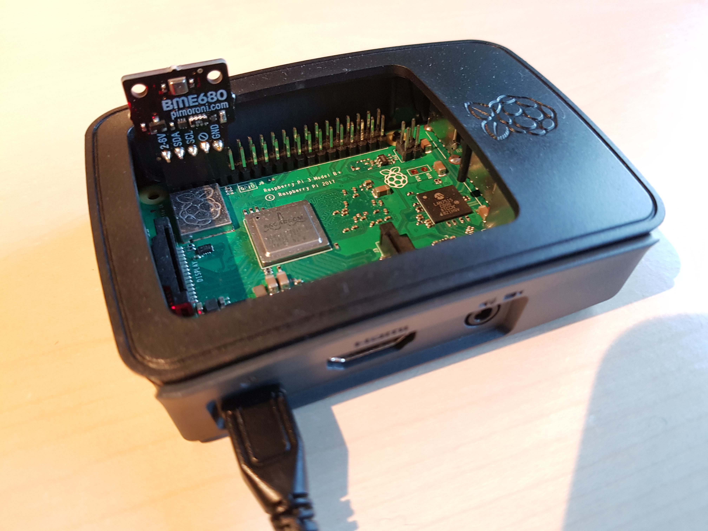

# Publishing Industrial Data with AWS IoT
In this tutorial we will obtain a value from a sensor and publish it to a topic on AWS. No added shenanigans; this is as simple as it gets.<br>
At the core of it, we want to grab a reading from the sensor, wrap it in a message with some useful metadata, and publish that to AWS IoT. We will want to do that continuosly on a loop, meaning that our script should end up being structured as follows.<br>
```
Prepare the sensor
Set up connection to AWS
while true
    get a sensor reading
    pack it up
    publish it
```
For the demonstration we will be using the Bosch BME680 air quality sensor connected to a Raspberry Pi model 3B. The BME680 does four different measurements, but for this case we will only be measuring and publishing the temperature. The Pi is just there to query the sensor and run the AWS IoT SDK. It essentially plays the part of a microcontroller, and so anything we accomplish here can be done with a microcontroller or any other compute device. In the final section of this demonstration we will discuss some of the additional considerations for a similar setup in an actual industrial setting.
<div align="center">
	
	
  <br>
  Schematic of the setup we are emulating in this demonstration and a picture of the actual hardware I used for developing the examples.
</div>

# Registering the Sensor in IoT Core
Before we can start connecting a sensor to AWS, we need to register the sensor or system as a so-called Thing in AWS IoT Core. The docs have a [getting started guide](https://docs.aws.amazon.com/iot/latest/developerguide/register-device.html "AWS IoT docs") which is pretty good. Follow the guide, but at the end of it, make sure you have the following:
* A device certificate file
* A private key file
* The root certificate file
* In the policy you attached to the certificate, you have allowed publishing from an ID and to a topic that you can remember

The three files should be installed on the controller device. In this case, that just means the files should be in accessible place on the Raspberry Pi. The ID will be used as clientID for the client that we will use to connect to AWS IoT in a little later, and the topic is a flag that helps you direct data along the right path. Both are explained in detail below.<br>
The policy used for examples in this case, follows this pattern:
```json
{
  "Version": "2012-10-17",
  "Statement": [
    {
      "Effect": "Allow",
      "Action": [
        "iot:Publish",
        "iot:Receive"
      ],
      "Resource": [
        "arn:aws:iot:your-region:your-aws-account:topic/bme680/temperature"
      ]
    },
    {
      "Effect": "Allow",
      "Action": [
        "iot:Connect"
      ],
      "Resource": [
        "arn:aws:iot:your-region:your-aws-account:client/simple-publishing"
      ]
    }
  ]
}
```
# Setting up the SDK
We will do scripting for this case using Python. AWS IoT currently has two SDKs for Python. For this case we will use version 1, which is easily installed using pip:
```bash
pip install AWSIoTPythonSDK
```
The AWS IoT code below should work for any version of Python, but the interaction with the BME680 sensor is written with Python 3.5. It should work for 3.7 with some minor adjustments (3.7 uses the smbus2 library in place of smbus) but otherwise it should work for all other versions of Python 2 and 3.
# Publishing to AWS IoT
Now we are ready to get started on developing with the SDK.<br>
Publishing a message to AWS using the Python SDK will look something like this
```python
AWSIoTMQTTClient.publish(topic, messageJSON, 1)
```
The AWSIoTMQTTClient is the object that we will use to configure and establish the connection to AWS IoT Core. The [.publish()](https://s3.amazonaws.com/aws-iot-device-sdk-python-docs/sphinx/html/index.html#AWSIoTPythonSDK.MQTTLib.AWSIoTMQTTClient.publish "AWS docs") method publishes the message and takes three arguments: the topic to publish to, the message to be sent, and a Quality of Service (QoS) flag. Lets look at each of these in turn.
### Topics
Messages in AWS are distributed and filtered using topics. Topics are a kind of tag that you can use to identify the source of the message and distribute it accordingly. It is just a single string, generally in the format
```
main_tag/secondary_tag/tertiary_tag/etc
```
For instance, if you had several factories each with several manufacturing lines with several stations each eqipped with sensors, you might do something like
```
factoryA/line22/drying/temperature
```
and then have another sensor on the same line publish to
```
factoryA/line22/milling/torque
```
That way you can direct these messages to the store or dashboard for the same line but seperate lambda functions, if that is needed for your application.<br>
An IoT thing needs permission to publish to a specific topic. This is done by adding a certificate with a permissive policy to the thing. By using the topic naming convention above and wildcards in the policy, you can create hierarchies and differentiated permissions for things in different parts of your application or factory setup.<br>
Now, for this demonstration example, we only have four sensors, and really we will only use one of them, so we will go with a simple topic. Like, say,
```
bme680/temperature
```
We will dive deeper into topics in the next tutorials, but for now we will leave it at this simple one.
### Message
The message contains the actual data along with any metadata. It is structured as a [JSON](https://www.youtube.com/watch?v=wI1CWzNtE-M "JSON tutorial") and you can put whatever you want in there, but you will want the data point, a timestamp for the time of sampling, and maybe an idication whether the reading was succesful or not. In our script, we will structure the message to look something like this, when the sensor reading is successful
```json
{
    "utc_timestamp": 1581417910,
    "value": 23.6,
    "origin": "BME680 temperature",
    "status": "success"
}
```
### Quality of Service (QoS)
The messages are published to AWS using the MQTT protocol. This is a protocol commonly used in manufacturing systems, and is documented [online](http://mqtt.org/documentation "MQTT documentation"). You can also read about the [AWS flavour](https://docs.aws.amazon.com/iot/latest/developerguide/mqtt.html "AWS MQTT Documentation") of MQTT.<br>
As for Quality of Service (QoS), it is a flag specifying what happens when messages get lost in the network. The AWS flavour of MQTT accepts two QoS flags, 0 means that the message is delivered 'at most once'. 1 means that the message is delivered 'at least once'. So for QoS 0 the publisher will send the message once and then forget about it. If it does not get delivered, it is lost. For QoS, however, the message is sent, and the publisher then waits for a reply from the receiver before forgetting the message, and resends if neccessary. This ensures that the receiver gets the message at least once.<br>
Now, there are cases where QoS=0 is sufficient, but for this case we will use QoS=1.
# Connecting to AWS IoT
Before we can publish a message, we need to set up and configure the connection to AWS IoT. For this, we are going to need many small bits of information. Let us start by setting up the client.
```python
from AWSIoTPythonSDK.MQTTLib import AWSIoTMQTTClient
# Initialise client
myAWSIoTMQTTClient = AWSIoTMQTTClient(clientId)
```
First of all, we are giving our client a client ID. This ID is used by the message broker to recognise the specific client or application that it is communicating with. This is especially importtant when we start subscribing to topics as well. For now, just provide an ID allowed by the policy made earlier.<br>
Next up we will setup the networking specifics.
```python
myAWSIoTMQTTClient.configureEndpoint(host, port)
myAWSIoTMQTTClient.configureCredentials(rootCAPath, privateKeyPath, certificatePath)
```
We are specifying where the MQTT messages are going and how they are authenticated. The host is your AWS IoT custom endpoint which you can find in the AWS Console under IoT Core > Settings. As for the port we will use the default 8883 for MQTT with the X.509 client certificate. Bringing us to the next order of business; certificates. The certificates are the ones you downloaded to your device earlier. You simply provide strings with the paths to each of these certificates; the root certificate file, the private key file, and finally the device certificate file.<br>
Next, we configure what happens when connection between the client and the broker on AWS IoT is lost.
```python
myAWSIoTMQTTClient.configureAutoReconnectBackoffTime(1, 32, 20)
myAWSIoTMQTTClient.configureOfflinePublishQueueing(-1)  # Infinite offline Publish queueing
myAWSIoTMQTTClient.configureDrainingFrequency(2)  # Draining: 2 Hz
myAWSIoTMQTTClient.configureConnectDisconnectTimeout(10)  # 10 sec
myAWSIoTMQTTClient.configureMQTTOperationTimeout(5)  # 5 sec
```
With `.configureAutoReconnectBackoffTime(1, 32, 20)` we are telling the client to try to reconnect every 1 seconds after losing connection. If connection keeps being lost, for instance under poor networking conditions, this is exponentially increased to a maximum of every 32 seconds. This is to prevent having too many connection requests which would make the network conditions even works. If connection is maintained for more than 20 seconds, the reconnect interval is reset to 1.<br>
Next we are telling the client to keep all untransmitted messages while connection is lost by setting `.configureOfflinePublishQueueing(-1)`. If any other number is passed, this is the number of messages kept.<br>
When connection is reestablished, we will want to send off any kept messages, but not all at once. With `.configureDrainingFrequency(2)` we are telling the client to send one queued message every 2 seconds.<br>
In a moment, we will connect the client, by sending a connect request to the broker on AWS IoT. The client will then expect an acknowledgement of the request, but we do not want to wait forever. `.configureConnectDisconnectTimeout(10)` tells the client to wait a maximum of 10 seconds before timing out.<br>
Earlier we decided to use QoS=1. This will only work if the server acknowledges any message sent. If that does not happen we will also want a timeout `.configureMQTTOperationTimeout(5)` means that we will wait 5 seconds for that acknowledgement.<br>
Now, all that remains is to attempt the connection.
```python
# Connect to AWS IoT
myAWSIoTMQTTClient.connect()
```
# Bringing it all together
Here is our bare-bones script for connecting and publishing to AWS IoT. 
```python
from AWSIoTPythonSDK.MQTTLib import AWSIoTMQTTClient
import time

# We will just hardcode the default port here, you might want a different one
port = 8883 # default

# Initialise the AWS IoT MQTT client
myAWSIoTMQTTClient = AWSIoTMQTTClient(clientId)
myAWSIoTMQTTClient.configureEndpoint(host, port)
myAWSIoTMQTTClient.configureCredentials(rootCAPath, privateKeyPath, certificatePath)

# Configure the client
myAWSIoTMQTTClient.configureAutoReconnectBackoffTime(1, 32, 20)
myAWSIoTMQTTClient.configureOfflinePublishQueueing(-1)  # Infinite offline Publish queueing
myAWSIoTMQTTClient.configureDrainingFrequency(2)  # 2 Hz
myAWSIoTMQTTClient.configureConnectDisconnectTimeout(10)  # 10 sec
myAWSIoTMQTTClient.configureMQTTOperationTimeout(5)  # 5 sec

# Connect to AWS IoT
myAWSIoTMQTTClient.connect()
time.sleep(2)

# Publish to the same topic in an eternal loop
loopCount = 0
while True:
    message = {}
    message['sequence'] = loopCount
    message['timestamp_utc'] = datetime.utcnow().strftime("%Y-%m-%dT%H:%M:%S.%fZ")
    # Value and any other data needed here
    messageJson = json.dumps(message)
    # This is the actual publishing to AWS
    myAWSIoTMQTTClient.publish(topic, messageJson, 1)
    loopCount += 1
    time.sleep(5)
```
The script [simple_publishing.py](simple_publishing.py) is a full working example using the BME680 sensor. I can be called as follows
```bash
python simple_publishing.py -e <your aws iot endpoint> -r <file containing root certificate> -c <file containing device certificate> -k <file containing private key> -id <a client ID> -t <the topic to publish to>
```
# Running the Case
Running this script on a Pi with the BME680 sensor, when it is working, it should look like this
```
Published topic bme680/temperature: {"status": "success", "timestamp_utc": "2020-02-15T16:43:16.226983Z", "value": 21.57999999999999, "sequence": 25}

Published topic bme680/temperature: {"status": "success", "timestamp_utc": "2020-02-15T16:43:17.348050Z", "value": 21.57999999999999, "sequence": 26}

Published topic bme680/temperature: {"status": "success", "timestamp_utc": "2020-02-15T16:43:18.519356Z", "value": 21.57999999999999, "sequence": 27}
```
But the most interesting part, of course, is whether the data gets to AWS. Let us say that we published to the topic `BME680/temperature`. We can open the AWS Console, go to IoT Core, and find the Test tab. Here we can subscribe to a topic. When I type in the topic `BME680/temperature`, 

I get the messages sent from the Pi.

Congratulations, you are now publishing to AWS IoT! From here the messages can be redirected to whereever you want using AWS SNS, for instance to AWS Kinesis.<br>
# In Production
This section is not part of the demonstration as such. It is but a short discussion of some of the considerations we have to take when bringing an IoT device to production in a manufacturing environment and how to improve upon the example to make it production ready.
## Hardware Setup
In real life would you fire up a Raspberry PI running Python just to extract and publish data from a single sensor? No, probably not. In a real life setting, if you just wanted to publish data from a single sensor, you might use a microcontroller instead. On the other hand, if you are in an industrial setting have hundreds of sensors that you want to query and publish, a Raspberry Pi will not be enough. Instead you might want to use proper gateway devices and controller modules. There are multiple options and suppliers of this type of hardware components and which you choose all depends on your specific requirements for ease of installation, configurability, and data quality.<br>
No matter what kind of hardware you have, your gateway device still needs to run some bit of software that gathers and publishes data to consumer applications. Many hardware suppliers also offer proprietary data feeders and even analytics, but now you know how to write your own simple data feeder using the AWS IoT SDK for Python.
## Script Improvement
The focus for this demonstration was to demonstrate how to quickly get started publishing data. Whether we use a microcontroller or a large server as our gateway device, we will want a bit more functionality for our script. Here are a few examples of what additional considerations we might take before deploying the device to production.
### Logging
All sorts of expected and unexpected stuff will happen in production, and it is at least nice to have logs telling you what happened. The AWS IoT SDK actually comes with a [sample](https://github.com/aws/aws-iot-device-sdk-python/blob/master/samples/basicPubSub/basicPubSub.py) script containing an example of logging:
```python
import logging
logger = logging.getLogger("AWSIoTPythonSDK.core")
logger.setLevel(logging.DEBUG) # You might want to pass logging level to your script
streamHandler = logging.StreamHandler()
formatter = logging.Formatter('%(asctime)s - %(name)s - %(levelname)s - %(message)s')
streamHandler.setFormatter(formatter)
logger.addHandler(streamHandler)
```
Also do not forget to add logging for the interaction with your sensor(s).
### Error Handling
Besides logging loggging unexpected events, we might also want to automatically handle some of them and avoid crashes that need manual attention. In the example we created above, two parts in particular are susceptible to errors; connecting the MQTT client to AWS and querying the sensor.<br>
The connection might fail for several reasons, but a common one is that multiple devices try to reconnect at the same time after a restart of the process they are monitoring. In this case, nothing is wrong as such, and we can just have the devices retry the connection. We will want to introduce a bit of randomness into that process to avoid creating another bottlenect. An elegant way to implement such retrying is with progressive backoff logic, and the AWS IoT SDK actually includes a module to do just that.<br>
In the example script, whenever I fail to retrieve a value from my BME680 air quality sensor, I just generate a message with a None value. Depending on your application, you might want to do something different. In another demonstration, we will have a look at [implementing a Shadow](shadow.md "Shadow demonstration") for our device. The Shadow can act as an intermediary between the data feed and an application, ensuring that simulations and machine learning models always have the latest readings, while the live data feed contains the full diversity of values and failed readings.
### Remote Configuration
One challenge we face when creating new data streams is specifying what data we need and how often we want to sample it. The dilemma is that we do not want to store to much data that will not be used but, on the other hand, to create good simulations or models, we need a good bit of historical data. What strategy to pursue is a business question but it behooves us as developers to allow for flexibility and build dials that allow us to adjust the tradeoff between cost and data quality/quantity. So let us tink of an example of this.<br>
At the end of the publishing loop, we tacitly added a line, `time.sleep(5)`, that ultimately determines how often we query our sensor and publish the data. If we double that time, we halve the amount of data and potentially also halve our exenses for data storage on this variable. Before the applications are in place, however, it is not really clear how often we would like to sample. We can make an educated guess to get it started but, at the end of the day, we want to be able to change it. So it seems a poor idea to hardcode it like we did for this example. Indeed, for the [next demonstration](pubsub.md "Pulish and subscribe demo") we will explore how to develop a dynamic device that is remotely configurable.
## Device Lifecycle
During the demonstration, we manually provisioned certificates for our device and started the script from the command line. For production purposes, especially if we have hundreds of devices, we might want to have a more rigid device lifecycle.
### Start up and restarts
In a production setting, we will not want to go and restart the script manually each time there is an issue or our device restarts. This obviously becomes more relevant as the number of devices increases. If your gateway device runs Linux, we can just create a custom systemd to run our data feeder script as a service on boot. For a large fleet of devices we might want to consider introducing some randomness into the intitial connection requests to prevent a situation where all devices attempt to reconnect simultaneaously after an outage.
### Certificates and security
It is possible to get [more advanced](https://aws.amazon.com/blogs/iot/provisioning-with-a-bootstrap-certificate-in-aws-iot-core/ "bootstrap certificate demonstration") about provisioning certificates for devices. At the very least, we will want to script the provisioning process.<br>
Even when securely provisioned and deployed, it is still important to consider the security of the certificates. The certificates effectively allow some interaction with your AWS account and should an ill intentioned actor acquire access to these certificates they effectly gain free access to that functionality. AWS best practice is to use [least privilege](https://docs.aws.amazon.com/IAM/latest/UserGuide/best-practices.html "IAM Best Practices") policies.<br>