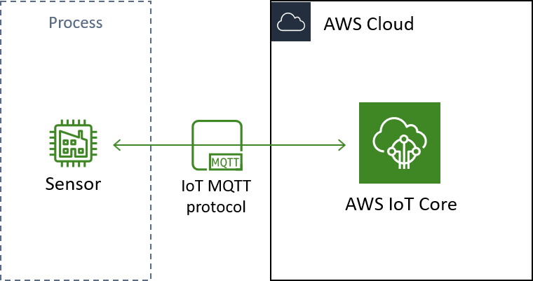
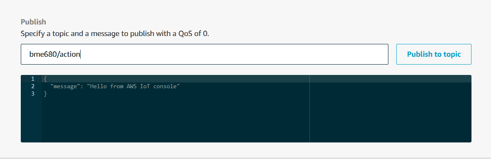

# Publishing and Subscribing with AWS IoT
In this demonstration, we will add upon the [previous](https://github.com/AnHosu/iot_poc/blob/master/publishing.md "simple publishing") tutorial by having our gateway device, the Raspberry Pi, subscribe to messages on a topic. With publishing, the information flow is from the device to AWS IoT, but with subscribing, the flow is reversed to be from AWS IoT to the client we configure to our device. As we will see, the ability to subscribe as well as publish, is extremely useful for structuring and managing devices remotely.<br>
In general terms, we want our device to do the following
```
prepare the sensor
configure connection to AWS
define what happens with subscriptions
start subscribing
while true
    react to any incoming messages
    get a sensor reading
    pack it up
    publish it
```
For the demonstration, are once again using the Bosch BME680 air quality sensor connected to a Raspberry Pi model 3B. The BME680 does four different measurements, and we will utilise the temperature, pressure, and humidity sensing capabilities. The Pi is just there to query the sensor and run the AWS IoT SDK. It essentially plays the part of a microcontroller, and so anything we accomplish here can be done with a microcontroller or any other compute device. In the final section of this demonstration we will discuss some of the additional considerations for a similar setup in an actual industrial setting.
<div align="center">
	
  <br>
  Schematic of the architecture we are building in this demonstration. Note the two-way communication between IoT Core and our Thing.
</div>

Connecting to AWS IoT and publishing messages were covered in the [previous](https://github.com/AnHosu/iot_poc/blob/master/publishing.md "simple publishing") demonstration. In this demonstration, we focus on subscribing to messages and combining publishing and subscribing within one client.
# Registering the Sensor in IoT Core
Just as it is the case with publishing, we need to register the device that will subscribe to messages. We can use the same Thing and certificate as in the [previous demonstration](publishing#registering-the-sensor-in-iot-core), but we need to change the policy to allow subscription through using that certificate. 
For subscription to work, we need to add two additional statements to the policy. We need to allow `iot:Subscribe` to a topic filter and allow `iot:Receive` for a specific topic. The distinction between topic and topic filter can seem nebulous, but imagine a manufacturing line with hundreds of sensors publishing to topics with the prefix `factoryA/line22`. Then we might create a policy that allows subscription to all the topics `factoryA/line22/*`, where the asterisk is a wildcard, and policies that allow receiving of messages to specific topics such as `factoryA/line22/milling/torque`. 
Here is an example of such a policy document that allows subscription and receiving to a single topic.
```json
{
  "Version": "2012-10-17",
  "Statement": [
    {
      "Effect": "Allow",
      "Action": [
        "iot:Publish"
      ],
      "Resource": [
        "arn:aws:iot:your-region:your-aws-account:topic/bme680/temperature",
        "arn:aws:iot:your-region:your-aws-account:topic/bme680/pressure",
        "arn:aws:iot:your-region:your-aws-account:topic/bme680/humidity",
        "arn:aws:iot:your-region:your-aws-account:topic/bme680/actions"
      ]
    },
    {
      "Effect": "Allow",
      "Action": [
        "iot:Receive"
      ],
      "Resource": [
        "arn:aws:iot:your-region:your-aws-account:topic/bme680/actions"
      ]
    },
    {
      "Effect": "Allow",
      "Action": [
        "iot:Subscribe"
      ],
      "Resource": [
        "arn:aws:iot:your-region:your-aws-account:topicfilter/bme680/actions"
      ]
    },
    {
      "Effect": "Allow",
      "Action": [
        "iot:Connect"
      ],
      "Resource": [
        "arn:aws:iot:your-region:your-aws-account:client/simple-subscribing"
      ]
    }
  ]
}
```
This is the actual policy document for the following examples. It might seem like we are repeating the same thing many times, but there is a good reason for it. The subscription action is only checked whenever a client connects to AWS, whereas the receive policy is checked each time a message is sent. This means that we have the option to disallow messages from a specific topic to devices using this certificate, even if they are already subscribing to the topic. Maybe useful in your case, maybe not, but now you know it exists.
# Subscribing to Topics
Like publishing, subscribing can be done with just one line of code. We just need to call the [.subscribe()](https://s3.amazonaws.com/aws-iot-device-sdk-python-docs/sphinx/html/index.html#AWSIoTPythonSDK.MQTTLib.AWSIoTMQTTClient.subscribe "subscribe docs") function of the IoT client.
```python
AWSIoTMQTTClient.subscribe(topic, 1, callback)
```
The first argument is the topic to listen to. Note that the certificate provided to the client must have a policy that allows subscription to that specific topic.<br>
The second argument is the Quality of Service, [just as for publishing](publishing.md#quality-of-service-qos), 0 means that the message is delivered at most once and 1 means at least once. Remember that now the roles are reversed, and the client we are configuring is the one that will receive the message have to send a confirmation of a message received. Fortunately that is all taken care of behind the scenes in the client we are configuring.<br>
The third argument is a custom function that is called whenever a message is received on the topic. This function should follow the pattern `callback_function(client, userdata, message)`. `message` will then be an object containing the topic, `message.topic`, and the body, `message.payload`, of the message. The two variables `client` and `userdata` are there for compatibility of the callback stack; they are flagged for deprecation, and it is not recommended to rely on them. The simplest thing to do when receiving a message, save for doing nothing at all, would be to print the message. Such a function might look like this
```python
def callback_function(client, userdata, message):
    print("Received a new message:\n{0}".format(message.payload))
    print("from topic:\n{0}".format(message.topic))
```
In the next section, we will use this function to do cool things.<br>
The subscription can be set up as soon as connection between the client and AWS IoT is established. The client will then listen for any published messages for as long as it lives or until the subscription is terminated. This also means that we do not have to listen in an infinite loop like during publishing.<br>
With this, we have everything needed to set up a subscription:
```python
# Configure client and connect
myAWSIoTMQTTClient = AWSIoTMQTTClient(clientId)
myAWSIoTMQTTClient.configureEndpoint(host, port)
myAWSIoTMQTTClient.configureCredentials(rootCAPath, privateKeyPath, certificatePath)
myAWSIoTMQTTClient.configureAutoReconnectBackoffTime(1, 32, 20)
myAWSIoTMQTTClient.configureOfflinePublishQueueing(-1)  # Infinite offline Publish queueing
myAWSIoTMQTTClient.configureDrainingFrequency(2)  # Draining: 2 Hz
myAWSIoTMQTTClient.configureConnectDisconnectTimeout(10)  # 10 sec
myAWSIoTMQTTClient.configureMQTTOperationTimeout(5)  # 5 sec
myAWSIoTMQTTClient.connect()
time.sleep(2)

# Define what happens when messages are received
def callback_function(client, userdata, message):
    print("Received a new message:\n{0}".format(message.payload))
    print("from topic:\n{0}".format(message.topic))

# Subscribe
AWSIoTMQTTClient.subscribe(topic, 1, callback)

# Wait for messages to arrive
while True:
    time.sleep(5)
```
A full working example can be found [here](example_scripts/simple_subscribing.py "simple subscribing example"). We run the script from a terminal on the Pi:
```bash
python simple_subscribing.py -e <your aws iot endpoint> -r <file containing root certificate> -c <file containing device certificate> -k <file containing private key> -id <a client ID> -t <the topic to subscribe to>
```
Nothing happens before we start publishing messages to our topic of choice. I ran the example on my Pi, using the topic `/bme680/actions`. I then moved to the test suite at AWS IoT Core > Test, and published a message to that topic.<br>
<div align="center">
	
  <br>
</div>

The console output on the Pi then looks like this:
```
Received a new message:
{
    "message": "Hello from AWS IoT Console"
}
from topic:
bme680/action
```
Congratulations! You now know how to subscribe to a topic using the AWS IoT Python SDK. The real power of subscription, however, lies in combining it with publishing. In the next section, we will build a small example of how to use subscription with publishing to great effect.
# A Subscription Example
In the case of simple publishing we were getting temperature readings from the BME680 sensor and published them to AWS IoT on an infinite loop. However, the BME680 sensor is also able to measure relative humidity and air pressure. In real life you would want to use this expensive sensor to measure all three at once, but for this case we are going to build a way for us to remotely toggle between measuring these three variables. We will set up a subsription that listens to commands published on a specific topic. We will then use the content of that message to change which variable is measured and published by the device and sensor.<br>
First we will choose our topics. We will publish on three different topics depending on the variable that we are measuring.
```
bme680/temperature
bme680/pressure
bme680/humidity
```
In addition to this, we will reserve a topic for publishing actions to our device.
```
bme680/action
```
Imagine now that we will publish messages on this topic telling the device what to do. For instance, we might send the message
```json
{
    "action":"pressure"
}
```
telling the device to switch to measuring pressure and publish on the appropriate topic. Publishing this message will be simple enough using the AWS IoT test suite, but we need to code up the response behaviour first. To this end, we will use the callback function
```python
topic = None
variable = None
def callback_function(client, userdata, message):
    payload = json.loads(message.payload)
    global pubtopic
    global variable
    if "action" not in payload:
        topic = None
        variable = None
    else:
        if payload["action"] == "temperature":
            topic = "bme680/temperature"
            variable = "temperature"
        elif payload["action"] == "pressure":
            topic = "bme680/pressure"
            variable = "pressure"
        elif payload["action"] == "humidity":
            topic = "bme680/humidity"
            variable = "humidity"
        else:
            topic = None
            variable = None
```
We will then use these global variables to adjust what variable we get from the sensor before publishing on the infinite loop.
```python
while True:
    if sensor.get_sensor_data():
        # Get the value currently toggled
        value = None
        if variable = "temperature":
            value = sensor.data.temperature
        elif variable = "pressure":
            value = sensor.data.pressure
        elif variable = "humidity":
            value = sensor.data.humidity
        elif:
            value = None
        message = {}
        message['value'] = value
        message['variable'] = variable
        message['timestamp_utc'] = datetime.utcnow().strftime("%Y-%m-%dT%H:%M:%S.%fZ")
        message['status'] = "success"
        messageJson = json.dumps(message)
         # This is the actual publishing to AWS
        myAWSIoTMQTTClient.publish(topic, messageJson, 1)
        print('Published topic %s: %s\n' % (topic, messageJson))
        loopCount += 1
    else:
        message = {}
        message['value'] = None
        message['timestamp_utc'] = datetime.utcnow().strftime("%Y-%m-%dT%H:%M:%S.%fZ")
        message['status'] = "fail"
        messageJson = json.dumps(message)
         # This is the actual publishing to AWS
        myAWSIoTMQTTClient.publish(topic, messageJson, 1)
        print('Published topic %s: %s\n' % (topic, messageJson))
```
The whole script is [here](example_scripts/simple_pubsub.py "simple pubsub example"). When run, it will start to listen to the topic subscibed to. Once it receives a message with instructions it will start querying the sensor as instructed and publish. This way we can toggle between different sensors and even shut off messages when we do not need them and save some money.<br>
This might not be exactly the thing that you want your device to do, but now you have the building blocks to create whatever response you want. As a challenge, why not try to set up a topic that controls how often values are published from the device? With such functionality, you could adjust the tradeoff between storage cost and data granularity over time.
# In Production
Besides the considerations mentioned in the [previous demonstration](publishing.md#in-production), a few additional considerations apply now that we are able to establish two way communication with our devices in the IoT.
## Applications
First the fun part. What might we actually do with this added capability?
### Alternate data frequency
If you store and process less data, it will cost you less but will also give the data scientists less of that precious data paydirt. You might want to change the frequency of the data according to current business priorities. You will almost definitely want to change the rate to respond to the process. A simple on/off switch for when the process is not running will work wonders. I would, however, love to see a combined IoT and analytics application that chooses the sampling frequency based on variance in the data and automatically adjusts sampling accordingly.
### Have an equipment-debugging mode
The idea of a debugging mode is common in digital applications. IoT means brining the digital world to our physical equipment. Imagine having a debugging mode for our manufacturing equipment. Specifically, this could be a toggleable mode with telemetry from additional sources and at a high frequency.
### Respond to low-frequency changes
Control loop managed by PLCs do a great job of keeping a process in control and running smoothly and continuosly. One thing they do not do, however, is respond well to low frequency changes and business-induced changes. Think of a batch changeover or the change between product variants - it takes time and effort to get the equipment running smoothly again. If you have actuating devices as part of the IoT you can start having your manufacturing equipment respond to business priorities or just deal with changes that the PLC does not consider. An example could be an automatic change of settings on a change of product variant according to the predictions of a simulation or a model.
## Security
If you are in manufacturing or some other regulated context, it might sound scary to have a two way communication between your site and the cloud. In all fairness, this could pose a security risk, the magnitude of which depends on the extend of the liberties given to the IoT and connected applications. As developers, there are a number of considerations we can make to increase the robustness of the IoT and lessen the burden on ourselves when we maintain the application. This is by no means a full list, but just a few obvious starting points.
### Do not couple control loop and IoT
The end goal of our IoT application might be a kind of outer automation that responds to rare changes and optimises business parameters, but coupling your IoT with quality critical process control might not be a good idea, at least right away. Remember that even though your vision camera is not directly connected to your gateway device, you might still be able to get that delicious data by reading it from a database associated with the vision system.
### Limit the power of actions
Should someone with malicious content get access to publishing to a topic that initiates actions in the our gateway devices they will only be able to cause as much damage as we allow.<br>
For one of my first setup, I made my device run any bash command sent from the cloud. This is a fun exercise, but a very bad idea in a real manufactuing setting.
### Topic management
One thing, I have found useful is to use seperate topic hierarchies for topics that are intended for publishing data and topics that are intended for triggering work or actions.<br>
We have [previously](publishing.md#topics) discussed using hierarchies of topics to structure data published from a manufacturing site. If you have a topic hierarchy like `factoryA/line22/milling/torque`, it might be tempting to make the action topic something like `factoryA/line22/milling/action`. This could be a bad idea, since it is easy to create a policy like `factoryA/line22/*` that allows access to publishing and action topics. If instead we make topics like `action/factoryA/line22/milling` then at least it is more difficult to make policy mistakes while still keeping some of the hierarchical structure.<br>
Even without considering mistakes, poor topic management can quickly create a weak spot for your IoT both in terms of security and developer friendliness. AWS does not manage your topics, so make sure you do it. That being said, the AWS Device Shadow functionality might just be what you need to make this much simpler. Fortunately, Shadows are the subject of the [next demonstration](shadow.md).
### Read about security best practices
[AWS documentation](https://docs.aws.amazon.com/iot/latest/developerguide/security.html "AWS IoT Security Docs") is quite extensive and has better explanations and recommendations for security than I could ever conceive. Make sure to stay on top of current security best practices.