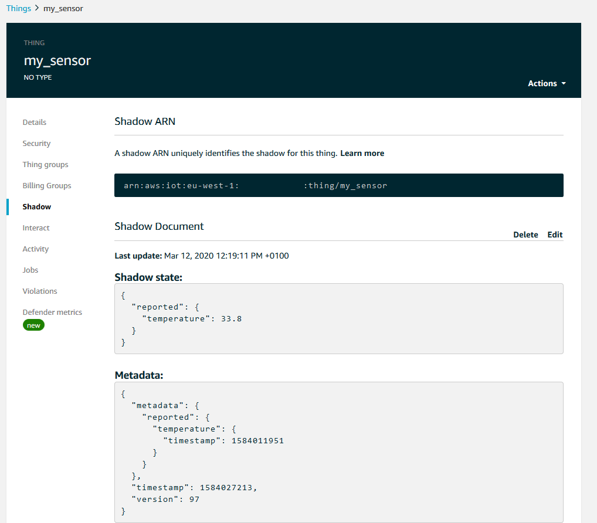
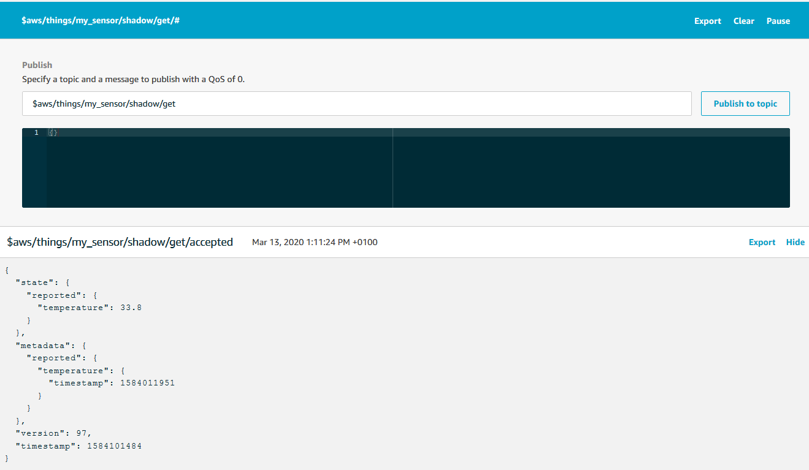
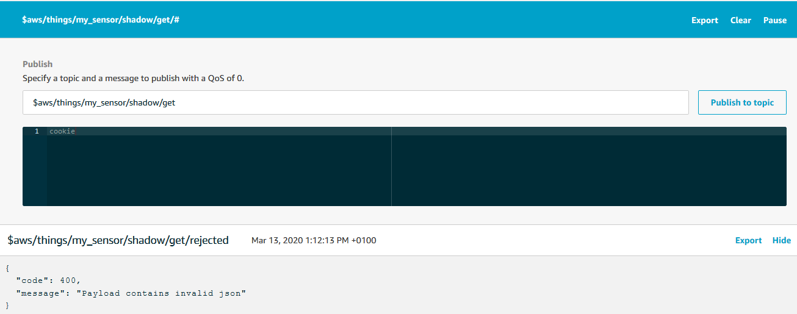
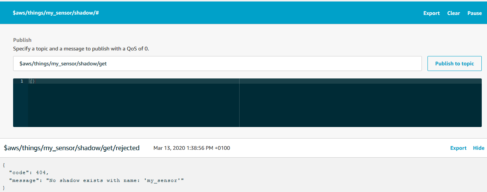

# AWS Shadow Service Demonstration
The AWS IoT thing shadow service offers a lot of functionality and the possible applications are numerous and diverse. You can read all about the functions and possible applications in the [documentation](https://docs.aws.amazon.com/iot/latest/developerguide/iot-device-shadows.html "AWS thing shadow docs"). In this case we will not exemplify all of the functionality, rather we will get started using shadows with an example that is as simple in functionality as possible. Once we are done with this case we will not have built all that is possible with shadows but we will have come far enough to start understanding advanced functions and applications work.<br>
We will try to do something like this
```
Prepare the sensor
Set up connection to AWS
while true
    get a sensor reading
    update the shadow
    publish the reading
    confirm that the shadow was updated
```
We will then look at the shadow document using the AWS IoT test functionality.
# The Shadow Document
The shadow of a thing is a JSON document containing predetermined fields. An example of a shadow document could be
```json
{
    "state":{
      "reported":{
        "value": 27.87
      }
    },
    "metadata":{
      "reported":{
        "value":{
          "timestamp":1583755496
        }
      }
    },
    "version":4,
    "timestamp":1583755643
}
```
Let us walk through each of the fields one at a time.<br>
`state` holds the current values of the thing. The `reported` field should hold the current values as reported by the device itself. It can hold any number of reporting fields and a field can be an array.<br>
Besides `reported` the `state` field can also hold a `desired` field which can hold desired values as requested by an application or another device. This could be useful if you are doing a case with automation or maybe a home IoT project.<br>
This could be the state of a thing consisting of a valve and a flow meter where an application or maybe a user has just requested a new state:
```json
{
    "state":{
      "reported":{
        "flow": 15.04,
        "valve_state": "open"
      },
      "desired":{
          "flow": 0,
          "valve_state": "closed"
      }
    }
}
```
We will not use the desired field for this demonstration. We will just report the latest temperature
```json
{
    "state":{
      "reported": { "temperature" : 21.6 }
    }
}
```
The `metadata`field holds information on when each of the values in the `state` field were updated. The field follows the sam schema as `state` and the information is given as a UTC timestamp, representing when the value was last updated.<br>
The `version` field is a super useful feature. It is an integer that increases every time an update is made to the document, allowing applications and device to know whether their local copy is the latest.<br>
The `timestamp` field indicates the UTC timestamp of when the update was transmitted from AWS IoT.<br>
Fields that are set to Null are deleted from the shadow document rather than reporting the Null.
You can read more about the shadow document in the [developer guide](https://docs.aws.amazon.com/iot/latest/developerguide/device-shadow-document.html "Shadow document developer guide")
# Updating a Device Shadow
Updating the shadow of a device is done by sending a message to a specific topic. The topic is in the format `$aws/things/yourDevice/shadow/update` and depends on the name of the device registered in AWS IoT. If your device was called 'factory3Airflow' then the topic would be `$aws/things/factory3Airflow/shadow/update`.<br>
The update message might look something like this
```json
{
    "state": {
        "reported": {
            "flow": 2.6
        }
    }
} 
```
Coding such a flow is quite similar to what we did for [publishing](https://github.com/AnHosu/iot_poc/blob/master/publishing.md "publishing case"), except the topic is a bit more elaborate. Assuming that the client ID is the same as the device name, we can configure a connection and start updating the shadow like this:
```python
# Define neccessary topics
topic_update = "$aws/things/" + clientId + "/shadow/update"

# Configure connection to AWS IoT

# Keep updating the shadow on an infinite loop
while True:
    message = {}
    temperature = get_sensor_reading()
    message["state"] = { "reported" : {"temperature" : temperature } }
    messageJson = json.dumps(message)
    # Update the shadow
    myAWSIoTMQTTClient.publish(topic_update, messageJson, 1)
    time.sleep(30)
```
This is fine and all but how do we know that it works?
# Subscribing to Shadow Updates
Whenever a shadow is successfully updated, it generates and publishes a message to the topic `$aws/things/yourDevice/shadow/update/accepted`. Once again, the exact name changes based on your device name. By subscribing to this specific topic with QoS = 1, your device or application can recieve updates whenever there are changes to the shadow.<br>
Another useful topic to subscribe to is `$aws/things/yourDevice/shadow/update/rejected`. A message is published to this topic whenever an update fails and can thus provide excellent feedback for an application or for debugging.<br>
You can subscribe to these topics just like you would any other topics. Again assuming that the client ID is identical to the device name, it might look something like this:
```python
# Define neccessary topics
topic_update = "$aws/things/" + clientId + "/shadow/update"

# Configure connection to AWS IoT

# Specify what to do, when we receive an update
def callback_update_accecpted(client, userdata, message):
    print("Got an update, on the topic:")
    print(message.topic)
    print("The message is this")
    print(message.payload)

# Specify what to do, when the update is rejected
def callback_update_rejected(client, userdata, message):
    print("The update was rejected. Received the following message:")
    print(message.payload)

# Subscribe
myAWSIoTMQTTClient.subscribe(topic_update + "/accepted", 1, callback_update_accepted)
myAWSIoTMQTTClient.subscribe(topic_update + "/rejected", 1, callback_update_rejected)
```
# Policies for Shadows
Before we move on to more shadow related topics, we should take a look at the policies needed to allow devices and applications to utilise these topics. The documentation is quite substantial and even provides [specific examples](https://docs.aws.amazon.com/iot/latest/developerguide/device-shadow-mqtt.html "shadow policy examples") for policies related to shadow interaction. Hence, I will refrain from repeating the documentation here, and we will instead construct an example.<br>
Imagine we have a device registered with the name my_sensor in AWS IoT. We would like to give the device access to establish a connection with AWS IoT, publish readings to the topic my_sensor/reading, update its shadow, and subscribe to the accepted and rejected responses generated on shadow update.<br>
We already know how to construct statements to allow connection and publishing.
```json
{
  "Statement": [
    {
      "Effect": "Allow",
      "Action": [ "iot:Publish" ],
      "Resource": [
        "arn:aws:iot:your-region:your-aws-account:topic/my_sensor/reading"
      ]
    },
    {
      "Effect": "Allow",
      "Action": [ "iot:Connect" ],
      "Resource": [ 
        "arn:aws:iot:your-region:your-aws-account:client/my_sensor" 
      ]
    }
  ]
}
```
To allow the desired shadow interactions, we will add another resource to the publish action, mentioning the topic `$aws/things/my_sensor/shadow/update`:<br>
```json
{
  "Statement": [
    {
      "Effect": "Allow",
      "Action": [ "iot:Publish" ],
      "Resource": [
        "arn:aws:iot:your-region:your-aws-account:topic/my_sensor/reading",
        "arn:aws:iot:your-region:your-aws-account:topic/$aws/things/my_sensor/shadow/update"
      ]
    }
  ]
}
```
To allow subscription we will add subscription and receive actions for two resources - one for each topic.
```json
{
  "Statement": [
    {
      "Effect": "Allow",
      "Action": [ "iot:Subscribe" ],
      "Resource": [
        "arn:aws:iot:your-region:your-aws-account:topicfilter/$aws/things/my_sensor/shadow/update/accepted",
        "arn:aws:iot:your-region:your-aws-account:topicfilter/$aws/things/my_sensor/shadow/update/rejected"
      ]
    },
    {
      "Effect": "Allow",
      "Action": [ "iot:Receive" ],
      "Resource": [
        "arn:aws:iot:your-region:your-aws-account:topic/$aws/things/my_sensor/shadow/update/accepted",
        "arn:aws:iot:your-region:your-aws-account:topic/$aws/things/my_sensor/shadow/update/rejected"
      ]
    }
  ]
}
```
Given that the two subscription topics have the same root and that there are more update/ topics to subsrcibe to, it is tempting to add something along the lines of `$aws/things/my_sensor/shadow/update/*`, giving a wildcard for anything below the update root. While this would indeed work as intended now, AWS reserves the right to add additional reserved topics to the existing structure. If we were to use a policy with this type of wildcard, we thus risk allowing access to future topics causing unintended behaviour or information breaches. Therefore AWS discourages the use of wildcards in this way.<br>
Our final policy looks like this:
```json
{
  "Version": "2012-10-17",
  "Statement": [
    {
      "Effect": "Allow",
      "Action": [ "iot:Publish" ],
      "Resource": [
        "arn:aws:iot:your-region:your-aws-account:topic/my_sensor/reading",
        "arn:aws:iot:your-region:your-aws-account:topic/$aws/things/my_sensor/shadow/update"
      ]
    },
    {
      "Effect": "Allow",
      "Action": [ "iot:Connect" ],
      "Resource": [ 
        "arn:aws:iot:your-region:your-aws-account:client/my_sensor" 
      ]
    },
    {
      "Effect": "Allow",
      "Action": [ "iot:Subscribe" ],
      "Resource": [
        "arn:aws:iot:your-region:your-aws-account:topicfilter/$aws/things/my_sensor/shadow/update/accepted",
        "arn:aws:iot:your-region:your-aws-account:topicfilter/$aws/things/my_sensor/shadow/update/rejected"
      ]
    },
    {
      "Effect": "Allow",
      "Action": [ "iot:Receive" ],
      "Resource": [
        "arn:aws:iot:your-region:your-aws-account:topic/$aws/things/my_sensor/shadow/update/accepted",
        "arn:aws:iot:your-region:your-aws-account:topic/$aws/things/my_sensor/shadow/update/rejected"
      ]
    }
  ]
}
```
You might notice that we added an `iot:Receive` action to the subscription topics. The subscription action is only checked whenever a client connects to AWS, whereas the receive policy is checked each time a message is sent. This means that we have the option to disallow messages from a specific topic to devices using this certificate, even if they are already subscribing to the topic. Maybe useful in your case, maybe not, but now you know it exists.
# Building the Demonstration
Now we have everything we need to build a full demonstration of shadow interaction. Now we know that we can structure the interaction in exactly the same way as with regular publishing and subscribing. There are but two key differences. The first is that we will publish and subscribe to the specific shadow topics. The second is that our published message follows the shadow document schema. Here is an example; You can have your callback functions do whatever you want, but I just wrote out some simple print statements:
```python
# Define topic for updates
topic_update = "$aws/things/" + clientId + "/shadow/update"

# Configure connection to AWS IoT

# Specify what to do, when we receive an update
def callback_update_accepted(client, userdata, message):
    print("Got an update, on the topic:")
    print(str(message.topic))
    print("The message is this")
    print(str(message.payload))

# Specify what to do, when the update is rejected
def callback_update_rejected(client, userdata, message):
    print("The update was rejected. Received the following message:")
    print(str(message.payload))

# Subscribe
myAWSIoTMQTTClient.subscribe(topic_update + "/accepted", 1, callback_update_accepted)
time.sleep(2)
myAWSIoTMQTTClient.subscribe(topic_update + "/rejected", 1, callback_update_rejected)
time.sleep(2)
# Publish to the same topic in a loop forever
while True:    
    message = {}
    if sensor.get_sensor_data():
        temperature = sensor.data.temperature
    else:
        temperature = None
    message["state"] = { "reported" : {"temperature" : temperature } }
    messageJson = json.dumps(message)
    # Update the shadow
    myAWSIoTMQTTClient.publish(topic_update, messageJson, 1)
    time.sleep(15)
```
The full working script is [here](https://github.com/AnHosu/iot_poc/blob/master/shadow.py "shadow example"). Remember that the clientID is assumed to be the name of the thing. I registered a thing called my_sensor in AWS IoT and gave its certificate a policy like the one we developed above. Then I ran this script on my Raspberry Pi with the BME680 sensor. Like this:
```bash
python shadow.py -e <your aws iot endpoint> -r <file containing root certificate> -c <file containing device certificate> -k <file containing private key> -id <a client ID>
```
With this we are publishing the latest sensor readings directly to the shadow and then regurgitating the message generated when the update is accepted or rejected. When it works, the output should look something like this:
```
Got an update, on the topic:
$aws/things/my_sensor/shadow/update/accepted
The message is this
b'{"state":{"reported":{"temperature":35.48}},"metadata":{"reported":{"temperature":{"timestamp":1584104617}}},"version":99,"timestamp":1584104617}'
```
If your setup is not working, make sure to check exactly which component is failing. If you are getting errors in the connection part, check whether your keys are for the right certificate and whether the certificate is activated. If you are getting an error in the subscription or publishing parts, check whether your policy gives the right accesses. Finally, you should not get any messages on the `/update/rejected` subject. If you do, one possible reason is that the message follows a wrong format.
# More Topics and Interacting with the Shadow
Congratulations! You now know how to set up a shadow for your device and you are ready to start building the foundation for your digital twin application. There are, however, a couple of extra details that you might want to know about before you start building the application.<br>
## Get the Shadow Document
If your application just listens to the `/update/accepted` you will have achieved nothing more by going through the shadow compared to just publishing. The real power of shadows is in always having the latest reading from your device available, while decoupling the device and the application.<br>
Now that we are having the device update its shadow each time a new reading is available, we can start having our application access that shadow document whenever it needs it. You can always view the shadow document of your thing by going to AWS IoT > Manage > Things, then select your device and go to the Shadow tab
<div align="center">
	
  <br>
</div>

This is nice for demonstration and debugging purposes, but your application needs to access the document programatically. The MQTT protocol does not do requests, and operates using the publish and subscribe model only. So the way for your application to request the shadow document on demand is to publish a request to a specific topic and subscribe to a response topic.
By sending an empty request, `{}`, to the topic `$aws/things/yourDevice/shadow/get` your application can trigger the shadow to publish a copy of the current shadow document to the subject `$aws/things/yourDevice/shadow/get/accepted`. The easiest way to see it in action is by subscribing to the `$aws/things/yourDevice/shadow/get/#` topicfilter in the test console and then publish an empty message to `/get`. I gave it a try here
<div align="center">
	
  <br>
</div>

This is also an excellent opportunity to explore what happens, when we do something unexpected. Here I published a string instead of a JSON, for instance:
<div align="center">
	
  <br>
</div>

The `/get` topic also has a `/rejected` subtopic that gives helpful error messages when requests are rejected.
## Deleting the Shadow Document
You might have guess this next topic group. We now know how to update and get the shadow document. Now we just need to know how to delete it. By publishing an empty message to the topic `$aws/things/yourDevice/shadow/delete` you delete the shadow document for yourDevice. On successful deletion, a confirmation is published to `/delete/accepted` and a message is published to `/delete/rejected` otherwise. Let us try to delete the shadow, then try to get, and see what happens:
<div align="center">
	
  <br>
</div>
<div align="center">
	
  <br>
</div>

We get an error message because there is no shadow document to get.
## Shadow Topics Summary
In summary, all shadow interaction topics are prefixed with `$aws/things/yourDevice/shadow` where 'yourDevice' is the ID of your thing as registered in AWS IoT. You interact with the shadow in three ways: you can update the shadow, get the shadow, or delete the shadow. These functions are triggered when messages are published to the topics `/update`, `/get`, or `/delete` repectively. When the actions succeed, messages are published to the `/accepted` subtopic. When the actions fail, messages are published to the `/rejected` subtopic with useful information for debugging.<br>
Not covered in this demonstration are the `/update/document` and `/update/delta` topics. You can read more about all shadow interaction topics and find more example policies in the [docs](https://docs.aws.amazon.com/iot/latest/developerguide/device-shadow-mqtt.html "Shadow interaction docs").