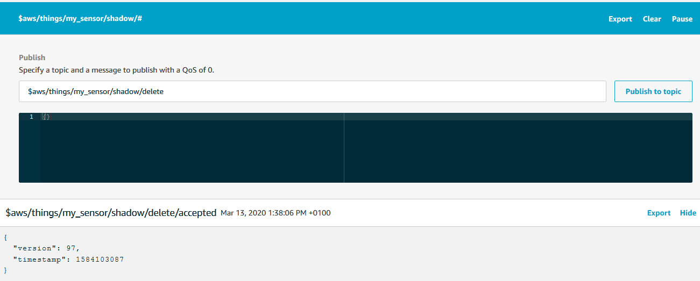

# Utilise Thing Shadows
On its own, a Thing Shadow might not look like much or even that useful. It certainly is an extra layer of complexity on top of publishing and subscribing. Shadows are, however, the foundation on which we can build Digital Twins and are an almost neccessity for applications that run machine learning models on the IoT data.<br><br>
So what exactly is the Shadow of a Thing? In a moment we will dive into the technical details, but we can think of a Shadow as an entity that has the same abilities as a Thing, it can send and receive messages, except that it is always an exact copy of the latest state of the Thing. If the thing goes offline, the Thing will still be there reporting the latest state of the thing. A Shadow is purely a software construct, there is no hardware, but it can live in the cloud, on the edge, or both.<br><br>
Before we get started, it should be said that the [documentation](https://docs.aws.amazon.com/iot/latest/developerguide/iot-device-shadows.html "AWS thing shadow docs") for Shadows is quite good and definitely worth a read. Instead of repeating the documentation, we will expand on the previous demonstrations of [publishing](publishing.md "Publishing demonstration") and [subscribing](pubsub.md "pub/sub demonstration") with AWS IoT and MQTT messages, to include a cloud based Shadow of our Thing, the BME680 sensor. That is, we will not exemplify all of the Shadow functionality, rather we will get started using Shadows with an example that is as simple in functionality as possible. Once we are done with this case, we will have come far enough to start understanding how advanced functions and applications work.<br>
We will try to do something like this
```
Prepare the sensor
Set up connection to AWS
while true
    get a sensor reading
    update the shadow
    publish the reading
    confirm that the shadow was updated
```
We will then look at the shadow document using the AWS IoT test functionality.
<div align="center">
	
	<br>
  Schematic of the architecture we are building in this demonstration.
</div>

# Basics of Device Shadows
The shadow of a thing is a JSON document containing predetermined fields. All devices registered in AWS IoT are given the Shadow functionality by default, though the JSON is only generated the first time the Shadow is updated. An example of a shadow document could be
```json
{
    "state":{
      "reported":{
        "value": 27.87
      }
    },
    "metadata":{
      "reported":{
        "value":{
          "timestamp":1583755496
        }
      }
    },
    "version":4,
    "timestamp":1583755643
}
```
Let us walk through each of the fields one at a time.<br><br>
`state` holds the current values of the thing. The `reported` field should hold the current values as reported by the device itself. It can hold any number of reporting fields and a field can be an array.<br>
Besides `reported` the `state` field can also hold a `desired` field which can hold desired values as requested by an application or another device. This could be useful if we were doing a case with automation or maybe a home IoT project.<br><br>
This could be the state of a thing consisting of a valve and a flow meter where an application or maybe a user has just requested a new state:
```json
{
    "state":{
      "reported":{
        "flow": 15.04,
        "valve_state": "open"
      },
      "desired":{
          "flow": 0,
          "valve_state": "closed"
      }
    }
}
```
We will not use the desired field for this demonstration. We will just report the latest temperature of our Thing like this
```json
{
    "state":{
      "reported": { "temperature" : 21.6 }
    }
}
```
The `metadata`field holds information on when each of the values in the `state` field were updated. The field follows the same schema as `state` and the information is given as a UTC timestamp, representing when the value was last updated.<br><br>
The `version` field is a super useful feature. It is an integer that increases every time an update is made to the document, allowing applications and device to know whether their local copy is the latest.<br><br>
The `timestamp` field indicates the UTC timestamp of when the update was transmitted from AWS IoT.<br><br>
Fields that are set to `Null` are deleted from the shadow document rather than reporting the `Null`.<br><br>
There are few additional features in shadow document and they are neatly described in the [developer guide](https://docs.aws.amazon.com/iot/latest/developerguide/device-shadow-document.html "Shadow document developer guide"). For now, we have all we need to get started.
## Update a Device Shadow
Updating the shadow of a device is done by sending a message to a specific topic. The topic is in the format `$aws/things/yourDevice/shadow/update` and depends on the name of the device registered in AWS IoT. If our device was called 'factory3Airflow' then the topic would be `$aws/things/factory3Airflow/shadow/update`.<br>
The update message might look something like this
```json
{
    "state": {
        "reported": {
            "flow": 2.6
        }
    }
} 
```
Coding such a flow is quite similar to what we did for [publishing](publishing.md "publishing case"), except the topic is a bit more elaborate. Assuming that the client ID is the same as the device name, we can configure a connection and start updating the shadow like this:
```python
# Define neccessary topics
topic_update = "$aws/things/" + clientId + "/shadow/update"

# Configure connection to AWS IoT
# ...

# Keep updating the shadow on an infinite loop
while True:
    message = {}
    temperature = get_sensor_reading()
    message["state"] = { "reported" : {"temperature" : temperature } }
    messageJson = json.dumps(message)
    # Update the shadow
    myAWSIoTMQTTClient.publish(topic_update, messageJson, 1)
    time.sleep(30)
```
This is fine and all but how do we know that it works?
## Subscribing to Shadow Updates
Whenever a Shadow is successfully updated, it generates and publishes a message to the topic `$aws/things/yourDevice/shadow/update/accepted`. Once again, the exact name changes based on our device name. By subscribing to this specific topic with QoS = 1, our device or application can recieve updates whenever there are changes to the Shadow.<br><br>
Another useful topic to subscribe to is `$aws/things/yourDevice/shadow/update/rejected`. A message is published to this topic whenever an update fails and can thus provide excellent feedback for an application or for debugging.<br><br>
We can subscribe to these topics just like we would any other topics. Again assuming that the client ID is identical to the device name, it might look something like this:
```python
# Define neccessary topics
topic_update = "$aws/things/" + clientId + "/shadow/update"

# Configure connection to AWS IoT
# ...

# Specify what to do, when we receive an update
def callback_update_accecpted(client, userdata, message):
    # Just print the message
    print("Got an update, on the topic:")
    print(message.topic)
    print("The message is this")
    print(message.payload)

# Specify what to do, when the update is rejected
def callback_update_rejected(client, userdata, message):
    # Just print the message
    print("The update was rejected. Received the following message:")
    print(message.payload)

# Subscribe
myAWSIoTMQTTClient.subscribe(topic_update + "/accepted", 1, callback_update_accepted)
myAWSIoTMQTTClient.subscribe(topic_update + "/rejected", 1, callback_update_rejected)
```
## Policies for Shadows
Before we move on to more shadow related topics, we should take a look at the policies needed to allow devices and applications to utilise these special topics. Once again, the documentation is quite substantial and even provides [specific examples](https://docs.aws.amazon.com/iot/latest/developerguide/device-shadow-mqtt.html "shadow policy examples") for policies related to shadow interaction. Here we will focus on constructing an example.<br><br>
Imagine we have a device registered with the name my_sensor in AWS IoT. We would like to give the device access to establish a connection with AWS IoT, publish readings to the topic my_sensor/reading, update its shadow, and subscribe to the accepted and rejected responses generated on shadow update.<br>
We already know how to construct statements to allow connection and publishing.
```json
{
  "Statement": [
    {
      "Effect": "Allow",
      "Action": [ "iot:Publish" ],
      "Resource": [
        "arn:aws:iot:your-region:your-aws-account:topic/my_sensor/reading"
      ]
    },
    {
      "Effect": "Allow",
      "Action": [ "iot:Connect" ],
      "Resource": [ 
        "arn:aws:iot:your-region:your-aws-account:client/my_sensor" 
      ]
    }
  ]
}
```
To allow the desired shadow interactions, we will add another resource to the publish action, mentioning the topic `$aws/things/my_sensor/shadow/update`:<br>
```json
{
  "Statement": [
    {
      "Effect": "Allow",
      "Action": [ "iot:Publish" ],
      "Resource": [
        "arn:aws:iot:your-region:your-aws-account:topic/my_sensor/reading",
        "arn:aws:iot:your-region:your-aws-account:topic/$aws/things/my_sensor/shadow/update"
      ]
    }
  ]
}
```
To allow subscription we will add subscription and receive actions for two resources - one for each topic.
```json
{
  "Statement": [
    {
      "Effect": "Allow",
      "Action": [ "iot:Subscribe" ],
      "Resource": [
        "arn:aws:iot:your-region:your-aws-account:topicfilter/$aws/things/my_sensor/shadow/update/accepted",
        "arn:aws:iot:your-region:your-aws-account:topicfilter/$aws/things/my_sensor/shadow/update/rejected"
      ]
    },
    {
      "Effect": "Allow",
      "Action": [ "iot:Receive" ],
      "Resource": [
        "arn:aws:iot:your-region:your-aws-account:topic/$aws/things/my_sensor/shadow/update/accepted",
        "arn:aws:iot:your-region:your-aws-account:topic/$aws/things/my_sensor/shadow/update/rejected"
      ]
    }
  ]
}
```
Given that the two subscription topics have the same root and that there are more update/ topics to subsrcibe to, it is tempting to add something along the lines of `$aws/things/my_sensor/shadow/update/*`, giving a wildcard for anything below the update root. While this would indeed work as intended now, AWS reserves the right to add additional reserved topics to the existing structure. If we were to use a policy with this type of wildcard, we thus risk allowing access to future topics causing unintended behaviour or information breaches. Therefore AWS discourages the use of wildcards in this way.<br>
Our final policy looks like this:
```json
{
  "Version": "2012-10-17",
  "Statement": [
    {
      "Effect": "Allow",
      "Action": [ "iot:Publish" ],
      "Resource": [
        "arn:aws:iot:your-region:your-aws-account:topic/my_sensor/reading",
        "arn:aws:iot:your-region:your-aws-account:topic/$aws/things/my_sensor/shadow/update"
      ]
    },
    {
      "Effect": "Allow",
      "Action": [ "iot:Connect" ],
      "Resource": [ 
        "arn:aws:iot:your-region:your-aws-account:client/my_sensor" 
      ]
    },
    {
      "Effect": "Allow",
      "Action": [ "iot:Subscribe" ],
      "Resource": [
        "arn:aws:iot:your-region:your-aws-account:topicfilter/$aws/things/my_sensor/shadow/update/accepted",
        "arn:aws:iot:your-region:your-aws-account:topicfilter/$aws/things/my_sensor/shadow/update/rejected"
      ]
    },
    {
      "Effect": "Allow",
      "Action": [ "iot:Receive" ],
      "Resource": [
        "arn:aws:iot:your-region:your-aws-account:topic/$aws/things/my_sensor/shadow/update/accepted",
        "arn:aws:iot:your-region:your-aws-account:topic/$aws/things/my_sensor/shadow/update/rejected"
      ]
    }
  ]
}
```
# Simple Shadow Updating
Now we have everything we need to build a full demonstration of shadow interaction. We know that we can structure the interaction in exactly the same way as with regular publishing and subscribing but with two key differences. The first is that we will publish and subscribe to the specific shadow topics. The second is that our published message follows the shadow document schema. Here is an example; We can have our callback functions do whatever we want, but I just wrote out some simple print statements:
```python
# Define topic for updates
topic_update = "$aws/things/" + clientId + "/shadow/update"

# Configure connection to AWS IoT
# ...

# Specify what to do, when we receive an update
def callback_update_accepted(client, userdata, message):
    # Just print the message
    print("Got an update, on the topic:")
    print(str(message.topic))
    print("The message is this")
    print(str(message.payload))

# Specify what to do, when the update is rejected
def callback_update_rejected(client, userdata, message):
    # Just print the message
    print("The update was rejected. Received the following message:")
    print(str(message.payload))

# Subscribe
myAWSIoTMQTTClient.subscribe(topic_update + "/accepted", 1, callback_update_accepted)
time.sleep(2)
myAWSIoTMQTTClient.subscribe(topic_update + "/rejected", 1, callback_update_rejected)
time.sleep(2)
# Publish to the same topic in a loop forever
while True:    
    message = {}
    if sensor.get_sensor_data():
        temperature = sensor.data.temperature
    else:
        temperature = None
    message["state"] = { "reported" : {"temperature" : temperature } }
    messageJson = json.dumps(message)
    # Update the shadow
    myAWSIoTMQTTClient.publish(topic_update, messageJson, 1)
    time.sleep(15)
```
The full working script is [here](https://github.com/AnHosu/iot_poc/blob/master/shadow.py "shadow example"). Remember that the clientID is assumed to be the name of the thing. I registered a thing called my_sensor in AWS IoT and gave its certificate a policy like the one we developed above. Then I ran this script on my Raspberry Pi with the BME680 sensor. Like this:
```bash
python3 shadow.py -e <your aws iot endpoint> -r <file containing root certificate> -c <file containing device certificate> -k <file containing private key> -id <a client ID>
```
With this we are publishing the latest sensor readings directly to the shadow and then regurgitating the message generated when the update is accepted or rejected. When it works, the output should look something like this:
```
Got an update, on the topic:
$aws/things/my_sensor/shadow/update/accepted
The message is this
b'{"state":{"reported":{"temperature":35.48}},"metadata":{"reported":{"temperature":{"timestamp":1584104617}}},"version":99,"timestamp":1584104617}'
```
If your setup is not working, make sure to check exactly which component is failing. If you are getting errors in the connection part, check whether your keys are for the right certificate and whether the certificate is activated. If you are getting an error in the subscription or publishing parts, check whether your policy gives the right accesses. Finally, you should not get any messages on the `/update/rejected` subject. If you do, one possible reason is that the message follows a wrong format.<br><br>
# More Shadow Topics
Congratulations! You now know how to set up a shadow for your device and you are ready to start building the foundation for your digital twin application. There are, however, a couple of extra details that you might want to know about before you start building the application.<br>
## Get the Shadow
If our application just listens to the `/update/accepted` we will have achieved nothing more by going through the Shadow compared to just plain publishing. The real power of Shadows is in always having the latest reading from our device available, while decoupling the device and the application.<br>
Now that we are having the device update its Shadow each time a new reading is available, we can start having our application access that Shadow document whenever it needs it. We can always view the shadow document of our thing by going to AWS IoT > Manage > Things, then selecting our device and go to the 'Shadow' tab
<div align="center">
	
  <br>
</div>

This is nice for demonstration and debugging purposes, but our application needs to access the document programatically. The MQTT protocol does not do requests, and operates using the publish and subscribe model only. So the way for our application to request the Shadow document on demand is to publish a request to a specific topic and subscribe to a response topic. Note that there is an alternative based on a REST API, which we will discuss in a [section](shadow.md#in-production) below, but for now we will stick to the MQTT way.
By sending an empty request, `{}`, to the topic `$aws/things/yourDevice/shadow/get` our application can trigger the shadow to publish a copy of the current shadow document to the subject `$aws/things/yourDevice/shadow/get/accepted`. The easiest way to see it in action is by subscribing to the `$aws/things/yourDevice/shadow/get/#` topicfilter in the test console and then publish an empty message to `/get`. I gave it a try here
<div align="center">
	
  <br>
</div>

This is also an excellent opportunity to explore what happens, when we do something unexpected. Here I published a string instead of a JSON, for instance:
<div align="center">
	
  <br>
</div>

The `/get` topic also has a `/rejected` subtopic that gives helpful error messages when requests are rejected.
## Delete the Shadow
You might have guessed this next topic group. We now know how to update and get the shadow document. Now we just need to know how to delete it. By publishing an empty message to the topic `$aws/things/yourDevice/shadow/delete` we delete the shadow document for `yourDevice`. On successful deletion, a confirmation is published to `/delete/accepted` and a message is published to `/delete/rejected` otherwise. Let us try to delete the shadow, then try to get, and see what happens:
<div align="center">
	
  <br>
</div>
<br>
<div align="center">
	
  <br>
</div>

We get an error message because there is no shadow document to get.
## Shadow MQTT Topics Summary
In summary, all shadow interaction topics are prefixed with `$aws/things/yourDevice/shadow` where 'yourDevice' is the ID of our thing as registered in AWS IoT. We interact with the shadow in three ways: we can update the shadow, get the shadow, or delete the shadow. These functions are triggered when messages are published to the topics `/update`, `/get`, or `/delete` repectively. When the actions succeed, messages are published to the `/accepted` subtopic. When the actions fail, messages are published to the `/rejected` subtopic with useful information for debugging.<br>
Not covered in this demonstration are the `/update/document` and `/update/delta` topics. You can read more about all shadow interaction topics and find more example policies in the [docs](https://docs.aws.amazon.com/iot/latest/developerguide/device-shadow-mqtt.html "Shadow interaction docs").
## The Shadow Client
Depending on the apllication and how we manage topics, it might be easier to use the special Shadow client that is included in the SDK. The Shadow client, once configured, takes care of publishing and subscribing to the right topics. That is, it does exactly what we did above but with fewer lines of code and without us having to state the topics explicitly.<br>
The client is configured and connected like any other MQTT client:
```python
from AWSIoTPythonSDK.MQTTLib import AWSIoTMQTTShadowClient

myAWSIoTMQTTShadowClient = AWSIoTMQTTShadowClient(clientId)
myAWSIoTMQTTShadowClient.configureEndpoint(host, port)
myAWSIoTMQTTShadowClient.configureCredentials(rootCAPath, privateKeyPath, certificatePath)
myAWSIoTMQTTShadowClient.configureAutoReconnectBackoffTime(1, 32, 20)
myAWSIoTMQTTShadowClient.configureConnectDisconnectTimeout(10)
myAWSIoTMQTTShadowClient.configureMQTTOperationTimeout(5)
myAWSIoTMQTTShadowClient.connect()
```
Now we create a handler, that takes care of the publishing and subscribing. All we have to do is pass it the name of the Thing, which we will assume is the same as the client ID:
```python
# Handles publishing and subscribing to Shadow topics
# Persists subscription
deviceShadowHandler = myAWSIoTMQTTShadowClient.createShadowHandlerWithName(clientIDFOr d, True)
```
The handler will subscribe to the response topics from the Shadow. By setting the second argument to True, we are telling the handler to persist the subscription, i.e. not close the subscription when a response is received. Depending on the application, it might be neccessary to close the subscription once a response is received. But since we only have one client interacting with the Shadow in our case, we can safely persist the subscription and avoid resubscribing every time we send an update.<br>
As with every other subscription, we need to tell the client what to do when a message is received with a callback function. The callback function is provided to the handler when we perform an update, but before we get there we need to actually define a function. The callback function for a Shadow client looks a bit different from the callback functions we saw for regular subscribing. It has a `payload` object, which contains the Shadow document, assuming that the update is accepted. It then has a `responseStatus` string, which can be either `"timeout"`, `"accepted"`, or `"rejected"` depending on how the update event went. Finally there is a `token` which can be used to trace the request, but we will not discuss it here. Here is an example of a callback function for an update request.
```python
import json

def shadow_callback_update(payload, responseStatus, token):
    if responseStatus == "timeout":
        print("The update request timed out.")
    if responseStatus == "accepted":
        payloadDict = json.loads(payload)
        print("The update request was accepted, here is the new state:")
        print(payloadDict["state"])
    if responseStatus == "rejected":
        print("The update request was rejected.")
```
Finally, we can start updating the Shadow. The message still has to follow the Shadow document syntax:
```python
while true:
    message = {}
    temperature = get_temperature() # Dummy function
    message["state"] = { "reported" : {"temperature" : temperature } }
    deviceShadowHandler.shadowUpdate(json.dumps(message), shadow_callback_update, 6)
    time.sleep(5)
```
This will send an update to the reported temperature state of the Shadow document. The handler will time out after six seconds, as specified in the third argument. The handler will then wait for the response and invoke the callback function once a response is received.
# In Production
This section is not part of the demonstration as such. It is but a short discussion of some of the considerations we might take when bringing the Shadow feature into production. There are not many addtional considerations besides those discussed for [publishing](publishing.md#in-production) and [subscribing](pubsub.md#in-production), but here are some of them.
## Decouple Application and Data Stream
In order for Shadows to be a boon and not just an added operational burden, it is important that we develop applications that utilise it properly. An example of an application that might benefit greatly from using Shadows is one that relies on machine learning models to predict outcomes for displaying or acting on. A machine learning algorithm needs all its features at the same time to produce a prediction, whereas the physical reality of our sensing equipment is that different features are reported at differing times and at different frequencies. Instead of having a large layer of business logic in front of the machine learning algorithm, the application could just serve the latest values as stored in the Shadow. This effectively decouples the data stream and the machine learning model, ensuring that our application can keep running even if a device is broken.
<div align="center">
	
	<br>
  This is a general view of how a Shadow could fit into the larger IoT.
</div>

## Shadow HTTP Interactions
Chances are that we do not want our application to deal with the MQTT protocol. The publish subscribe model works well for the IoT part where data is flowing to and from multiple sources to multiple targets. Our application, however, often just needs the latest piece of data, and it is a bit of hassle to deal with an MQTT client, publishing, and subscribing just to get a single piece of data once in a while.<br>
One of the major advantages of the Shadow functionality is that each Shadow exposes a [REST API](https://docs.aws.amazon.com/iot/latest/developerguide/device-shadow-rest-api.html) to which we can send regular HTTP requests and retrieve data.<br>
The API is exposed at
```
https://endpoint/things/yourDevice/shadow
```
Where the `endpoint` is our custom AWS IoT endpoint and `yourDevice` is the name of our Thing as registered in AWS IoT. We can send regular Get, Update, and Delete HTTP requests to this endpoint and get, update, or delete the Shadow correspondingly. Note though that the entity sending the requests must have permissions to do so. This can be achieved with an IAM user with proper policies, but we will not dive into the details here.